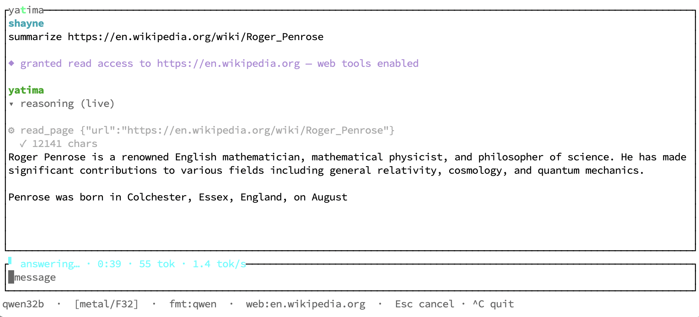

<p align="center">
  
</p>
<h1 align="center">yatima</h1>
<p align="center">
  language-integrated llms
</p>
<p align="center">
  <a href="https://github.com/shayne-fletcher/yatima/actions/workflows/build-and-test.yml">
    
  </a>
  <a href="https://shayne-fletcher.github.io/yatima/">
    
  </a>
</p>

`yatima` is a Rust runtime for using local LLMs inside typed programs. It loads
models in-process, renders each family's native chat template, and lets
tool-trained models act only through explicit, capability-scoped tools.

The point is not to wrap an LLM service, but to make model calls part of ordinary
Rust control flow: fetch evidence, normalize it into typed values, ask a local
model, then validate what it said against the data your program supplied. The
inference engine is rented from [candle](https://github.com/huggingface/candle);
weights are acquired by [`possum`](https://github.com/shayne-fletcher/possum).

<p align="center">
  
</p>

That frame is one turn, unstaged: the URL typed in the prompt **granted its
origin** for the session (nothing else can — a fetched page cannot mint
authority), the model fetched the page through its capability-scoped tool, and
the answer is streaming token-by-token with a live rate — cancellable at any
token with Esc.

## Quickstart

```bash
cargo build && cargo test

# interactive TUI — no flags, no config: type a URL to grant its origin
cargo run -p yatima-tui --release --features metal -- --profile qwen32b
# then:  summarize https://en.wikipedia.org/wiki/Roger_Penrose

# one-shot CLI chat
cargo run -p yatima-cli --release --features metal -- chat \
  --repo Qwen/Qwen2.5-7B-Instruct --format qwen --prompt "Explain Rust in two sentences."
```

Build with `--features metal` on Apple Silicon. A missing model is fetched on
demand with the `fetch` feature; `--offline` never touches the network.

## What it does

- **Generate / chat / agent** over local safetensors or GGUF/quantized weights.
- **Embed** the runtime in Rust — model output flows into native values and
  branches, no service boundary. Async-first; decode runs as a compute island
  that never stalls the executor.
- **Capability-scoped tools** — a tool holds its own authority (a root dir, a
  set of web origins); the model supplies arguments, not access. Web authority
  derives only from *user utterances*: type a URL and its origin is granted for
  the session; URLs inside fetched content grant nothing (CAP-3).
- **Streaming agent turns** — tool-calling turns render live, token by token,
  with reasoning and tool activity classified onto their own channel and
  tool-call markup never leaking into the answer (AGENT-4). Cancel lands at
  token granularity.
- **Model-driven pagination** — long pages are read one window at a time; each
  truncation marker names the next offset and continuations are served from a
  fetch-once cache, so a URL is fetched at most once per session (FETCH-1) —
  the shape a rate-limited host (e.g. SEC EDGAR) requires.
- **Reasoning models** — the chain-of-thought is split from the answer and kept
  out of conversation history.

Many families are supported across generate/chat; the agent/tools path is
narrower by design (Qwen/ChatML today). A `yatima-gui` crate (egui/wgpu) is an
early sibling frontend over the same engine actor.

Every guarantee above is a named invariant in the crate's registry, pinned by
tests that cite it — see the [design notes](notes/design.md).

**Honesty note:** the manifest pins a
[fork of candle](https://github.com/shayne-fletcher/candle) — upstream 0.11.0
plus a workaround for a Metal backend defect that corrupts generation past a
KV depth of 8,192. The diagnosis, the workaround's validated envelope, and the
canary test used to retire the fork on each candle upgrade are documented in
[notes/metal-kv-cliff.md](notes/metal-kv-cliff.md).

## Articles

- [The TUI](articles/tui.md) — the interactive session: runtime origin grants,
  live streaming, pagination, the keys and commands.
- [Models & quantization](articles/models.md) — the support matrix, the `‡`
  caveat, GGUF i-quant limits, and the candle fork.
- [Reasoning models](articles/reasoning-models.md) — think-block splitting,
  profiles, seeded vs. emitted markers.
- [CLI usage](articles/cli.md) — `generate`, `chat`, and the one-shot agent.
- [Embedding](articles/embedding.md) — the library surface and examples.
- [Auditable research](articles/auditable-research.md) — the SEC/XBRL
  investment-thesis demo and `sieve`.
- [Tools & capabilities](articles/capabilities.md) — the capability model,
  runtime grants, and observable async tools.
- [Architecture](articles/architecture.md) — the generate/chat/agent layering,
  streaming, the runtime, and diagnostics.
- [Relevant research](articles/relevant-research.md) — prior work that informs
  yatima's shape.

For the full invariant registry, state machines, and design rationale, see
[notes/design.md](notes/design.md).

## License

BSD-3-Clause. See [LICENSE](LICENSE).
