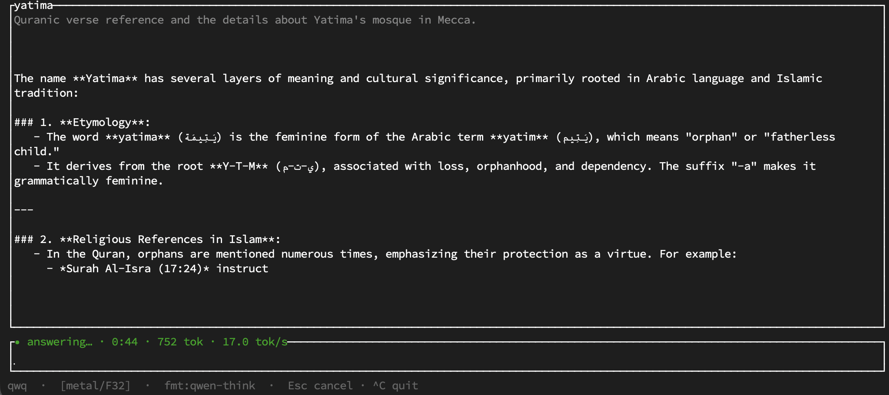

<p align="center">
  
</p>
<h1 align="center">yatima</h1>
<p align="center">
  language-integrated llms
</p>
<p align="center">
  <a href="https://github.com/shayne-fletcher/yatima/actions/workflows/build-and-test.yml">
    
  </a>
  <a href="https://shayne-fletcher.github.io/yatima/">
    
  </a>
</p>

`yatima` is a Rust runtime for using local LLMs inside typed programs. It loads
models in-process, renders each family's native chat template, and lets
tool-trained models act only through explicit, capability-scoped tools.

The point is not to wrap an LLM service, but to make model calls part of ordinary
Rust control flow: fetch evidence, normalize it into typed values, ask a local
model, then validate what it said against the data your program supplied. The
inference engine is rented from [candle](https://github.com/huggingface/candle);
weights are acquired by [`possum`](https://github.com/shayne-fletcher/possum).
Kindred in spirit to Anil Madhavapeddy's
[*Language Integrated LLMs as an OCaml Function*](https://anil.recoil.org/notes/language-integrated-llms).

<p align="center">
  
</p>

## Quickstart

```bash
cargo build && cargo test

# interactive TUI: streaming, foldable reasoning (Ctrl+R), context meter, Esc-to-cancel
cargo run -p yatima-tui --release --features metal -- --profile qwq

# one-shot CLI chat
cargo run -p yatima-cli --release --features metal -- chat \
  --repo Qwen/Qwen2.5-7B-Instruct --format qwen --prompt "Explain Rust in two sentences."
```

Build with `--features metal` on Apple Silicon. A missing model is fetched on
demand with the `fetch` feature; `--offline` never touches the network.

## What it does

- **Generate / chat / agent** over local safetensors or GGUF/quantized weights.
- **Embed** the runtime in Rust — model output flows into native values and
  branches, no service boundary. Async-first; decode runs as a compute island
  that never stalls the executor.
- **Capability-scoped tools** — a tool holds its own authority (a root dir, a web
  origin); the model supplies arguments, not access.
- **Reasoning models** — the chain-of-thought is split from the answer and kept
  out of conversation history.

Many families are supported across generate/chat; the agent/tools path is
narrower by design (Qwen/ChatML today).

## Articles

- [Models & quantization](articles/models.md) — the support matrix, the `‡`
  caveat, and GGUF i-quant limits.
- [Reasoning models](articles/reasoning-models.md) — think-block splitting,
  profiles, seeded vs. emitted markers.
- [CLI usage](articles/cli.md) — `generate`, `chat`, and the agent demo.
- [Embedding](articles/embedding.md) — the library surface and examples.
- [Auditable research](articles/auditable-research.md) — the SEC/XBRL
  investment-thesis demo and `sieve`.
- [Tools & capabilities](articles/capabilities.md) — the capability model and
  observable async tools.
- [Architecture](articles/architecture.md) — the generate/chat/agent layering,
  the runtime, and diagnostics.

For the full invariant registry, state machines, and design rationale, see
[notes/design.md](notes/design.md).

## License

BSD-3-Clause. See [LICENSE](LICENSE).
