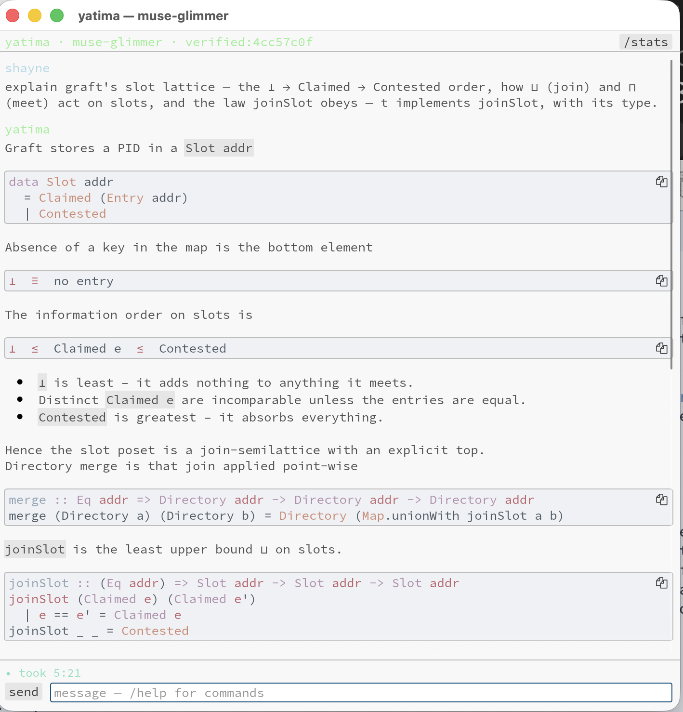

  

<h1 align="center">yatima</h1>

  language-integrated llms

  
  

 

  

  A local model, reasoning in Haskell and lattice notation.

 

  

  Images found and rendered in the turn that asked for them. 
  <a href="https://commons.wikimedia.org/wiki/File:Mandel_zoom_07_satellite.jpg">Wolfgang Beyer's Mandelbrot zoom series</a>, CC BY-SA 3.0.

 

  

  One unstaged turn.

 

## License

BSD-3-Clause. See [LICENSE](LICENSE).
