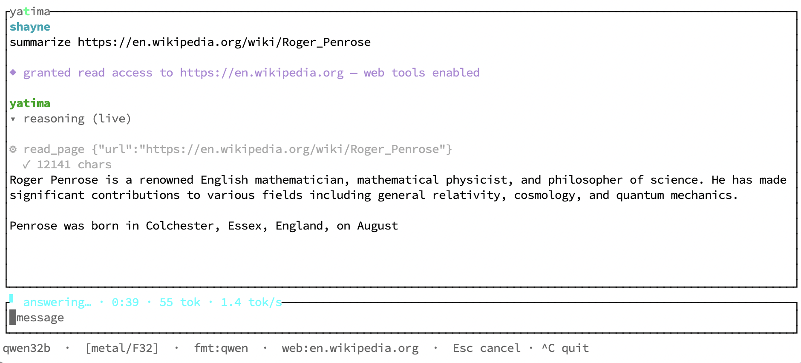
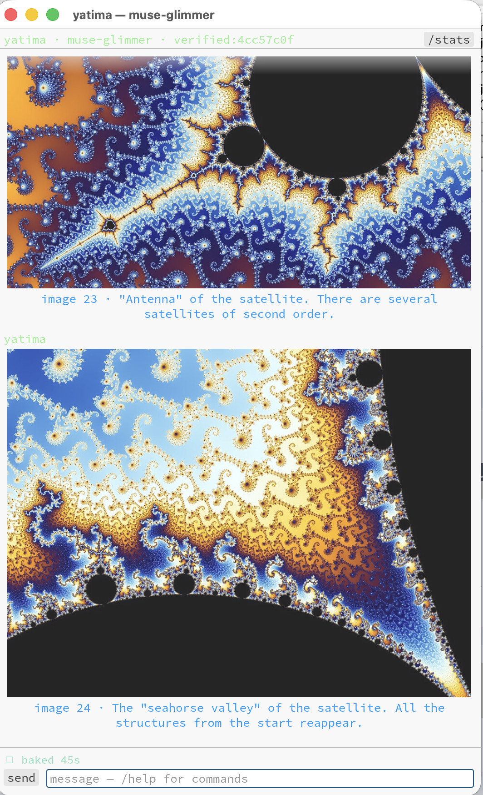

<p align="center">
  
</p>
<h1 align="center">yatima</h1>
<p align="center">
  language-integrated llms
</p>
<p align="center">
  <a href="https://github.com/shayne-fletcher/yatima/actions/workflows/build-and-test.yml">
    
  </a>
  <a href="https://shayne-fletcher.github.io/yatima/">
    
  </a>
</p>

`yatima` is a Rust runtime for local LLMs. Models run in-process through [Candle](https://github.com/huggingface/candle) or through a supervised [llama-server](https://github.com/ggml-org/llama.cpp).

Yatima keeps model calls in ordinary Rust control flow. It owns prompts, transcripts, tool protocols, and capability checks regardless of which backend generates the text.

<p align="center">
  
</p>

That is one unstaged turn. The URL granted its origin for the session, the model fetched the page through a capability-scoped tool, and the answer streamed live. New page origins still need approval; exact public images listed by an approved page may be fetched without a second grant.

<p align="center">
  
</p>

The native GUI, asked to find and render Mandelbrot images: each picture carries the list number and caption it was selected by — typed identity from the tool, never model prose — the rail pins the verified model digest, and the line by the input reports what the turn cost. <sub>Images shown: [Wolfgang Beyer's Mandelbrot zoom series](https://commons.wikimedia.org/wiki/File:Mandel_zoom_07_satellite.jpg), CC BY-SA 3.0.</sub>

## Quickstart

```bash
# Interactive TUI. Type a URL to grant its origin.
cargo run -p yatima-tui --release --features metal -- --profile qwen32b

# Verified Muse agent. read_file is confined to --root.
cargo run -p yatima-cli --release -- agent \
  --profile muse-glimmer --offline --root . \
  --prompt "Read README.md and explain what Yatima is."
```

Managed mode requires `llama-server` on `PATH`. Yatima verifies the model, starts the server on loopback, and reaps it on success, failure, or Ctrl-C. Missing weights are fetched through [`possum`](https://github.com/shayne-fletcher/possum); `--offline` disables network access.

## What it does

- Run local models through Candle or llama.cpp behind one `Completer` interface.
- Use Yatima through the CLI, TUI, native egui app, browser viewer, or embedded in Rust.
- Chat and run capability-scoped tools. Muse Glimmer's native ATEM protocol works through the CLI, TUI, native GUI, and browser viewer.
- Search the web, approve proposed sources, and render images discovered on approved pages.
- Give tools explicit authority such as a directory or a set of web origins.
- Stream reasoning, answers, and tool status without leaking protocol markup.

The crate registry names the important guarantees, and tests cite the laws they witness.

## Documentation

See the [articles](articles/README.md) for user and developer guides, including the [web-research workflow](articles/web-research.md). See the [design notes](notes/design.md) for invariants and implementation rationale.

## License

BSD-3-Clause. See [LICENSE](LICENSE).
