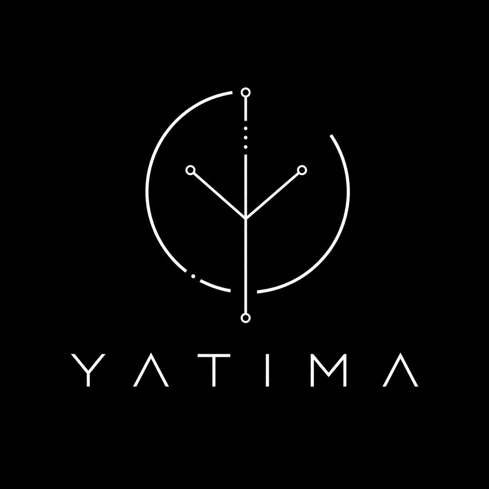

<p align="center">
  
</p>
<h1 align="center">yatima</h1>
<p align="center">
  language-integrated llms
</p>
<p align="center">
  <a href="https://github.com/shayne-fletcher/yatima/actions/workflows/build-and-test.yml">
    
  </a>
  <a href="https://shayne-fletcher.github.io/yatima/">
    
  </a>
</p>

`yatima` is a Rust runtime for using local LLMs inside typed programs. Its model-facing code targets the `Completer` trait: supported models can run in-process through [Candle](https://github.com/huggingface/candle), while CLI chat can use [llama.cpp](https://github.com/ggml-org/llama.cpp) through a supervised or already-running `llama-server`.

The point is to make model calls part of ordinary Rust control flow: fetch evidence, normalize it into typed values, ask a local model, then validate what it said against the data your program supplied. Yatima owns the prompt and response protocols, transcript, tool loop, and capability checks regardless of which backend produces the completion. Model weights are acquired by [`possum`](https://github.com/shayne-fletcher/possum).

<p align="center">
  
</p>

The backend supplies completions; Yatima supplies the program semantics. A model can propose a tool call, but only the capabilities explicitly held by that tool determine what the program may do.

## Quickstart

```bash
cargo build && cargo test

# interactive TUI — no flags, no config: type a URL to grant its origin
cargo run -p yatima-tui --release --features metal -- --profile qwen32b
# then:  summarize https://en.wikipedia.org/wiki/Roger_Penrose

# one-shot CLI chat
cargo run -p yatima-cli --release --features metal -- chat \
  --repo Qwen/Qwen2.5-7B-Instruct --format qwen --prompt "Explain Rust in two sentences."

# managed llama-server chat: acquire one exact GGUF, launch it, then reap it
cargo run -p yatima-cli --release -- chat \
  --backend llama-server \
  --repo bartowski/Qwen2.5-32B-Instruct-GGUF \
  --gguf Qwen2.5-32B-Instruct-Q4_K_M.gguf \
  --format qwen \
  --prompt "Explain Rust in two sentences."
```

Build the Candle backend with `--features metal` on Apple Silicon. Managed `llama-server` mode requires `llama-server` on `PATH`; Yatima binds it to loopback, waits for readiness, and stops and reaps it when the chat ends. A missing model is fetched on demand with the `fetch` feature; `--offline` never touches the network.

## What it does

- **Generate / chat / agent** through the in-process Candle engine over local safetensors or GGUF weights.
- **CLI chat through llama-server** — attach to a loopback server, or have Yatima acquire an exact GGUF and own the server process from startup through reap. This path brings llama.cpp-supported architectures into the same `Completer` interface without moving transcript or tool semantics into the server.
- **Embed** the runtime in Rust — model output flows into native values and branches. Candle inference stays in-process; `llama-server` is an explicit local transport adapter. Async completion does not block the executor's ordinary work.
- **Capability-scoped tools** — a tool holds its own authority (a root dir, a
  set of web origins); the model supplies arguments, not access. Web authority
  derives only from *user utterances*: type a URL and its origin is granted for
  the session; URLs inside fetched content grant nothing (CAP-3).
- **Streaming agent turns** — tool-calling turns render live, token by token,
  with reasoning and tool activity classified onto their own channel and
  tool-call markup never leaking into the answer (AGENT-4). Cancel lands at
  token granularity.
- **Model-driven pagination** — long pages are read one window at a time; each
  truncation marker names the next offset and continuations are served from a
  fetch-once cache, so a URL is fetched at most once per session (FETCH-1) —
  the shape a rate-limited host (e.g. SEC EDGAR) requires.
- **Reasoning models** — the chain-of-thought is split from the answer and kept
  out of conversation history.

Many families are supported across generate/chat; the agent/tools path is narrower by design (Qwen/ChatML today). The `llama-server` backend currently serves CLI chat; the TUI, GUI, server, and agent commands still use the in-process engine. A `yatima-gui` crate (egui/wgpu) is an early sibling frontend over the same engine actor.

Every guarantee above is a named invariant in the crate's registry, pinned by
tests that cite it — see the [design notes](notes/design.md).

**Honesty note:** the manifest pins a
[fork of candle](https://github.com/shayne-fletcher/candle) — upstream 0.11.0
plus a workaround for a Metal backend defect that corrupts generation past a
KV depth of 8,192. The diagnosis, the workaround's validated envelope, and the
canary test used to retire the fork on each candle upgrade are documented in
[notes/metal-kv-cliff.md](notes/metal-kv-cliff.md).

## Articles

- [The TUI](articles/tui.md) — the interactive session: runtime origin grants,
  live streaming, pagination, the keys and commands.
- [The browser viewer](articles/browser-viewer.md) — serve as the event plane
  over one WebSocket, the wasm client as a viewer; one turn's bytes across
  the seam.
- [Models & quantization](articles/models.md) — the support matrix, the `‡`
  caveat, GGUF i-quant limits, and the candle fork.
- [Reasoning models](articles/reasoning-models.md) — think-block splitting,
  profiles, seeded vs. emitted markers.
- [CLI usage](articles/cli.md) — `generate`, `chat`, the one-shot agent, and managed or attached `llama-server` workflows.
- [Embedding](articles/embedding.md) — the library surface and examples.
- [Auditable research](articles/auditable-research.md) — the SEC/XBRL
  investment-thesis demo and `sieve`.
- [Tools & capabilities](articles/capabilities.md) — the capability model,
  runtime grants, and observable async tools.
- [Architecture](articles/architecture.md) — the generate/chat/agent layering,
  streaming, the runtime, and diagnostics.
- [Relevant research](articles/relevant-research.md) — prior work that informs
  yatima's shape.

For the full invariant registry, state machines, and design rationale, see
[notes/design.md](notes/design.md).

## License

BSD-3-Clause. See [LICENSE](LICENSE).
