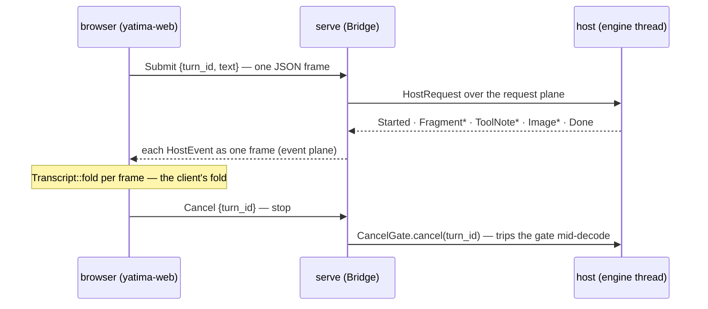

# The browser viewer

`yatima-serve` bridges a session to any browser on your tailnet;
`yatima-web` is the wasm client it hands that browser. Together they are
the vision's rung 2: the event plane over a WebSocket, every client a
viewer.

```bash
# build the client bundle once (web/ is wasm32-only, its own workspace;
# release is the one to hand a phone — 4.8 MB against 21 MB debug)
cd web && trunk build --release
# serve a model on the tailnet, handing out the bundle at /
cargo run -p yatima-serve --release --features metal -- \
  --profile qwen32b --bind 100.x.y.z:8787 --static-dir web/dist
```

Open `http://100.x.y.z:8787/` on the phone: the page loads the wasm app,
the app opens one WebSocket back to `/ws` on the same origin, and the
session streams. There is no default bind, and the unspecified addresses
are refused (SRV-1) — exposure beyond the tailnet is a decision nobody
makes by accident.

## One fold, one unfold

The shape underneath is a single duality. The host *unfolds*: from its
session state it produces the `HostEvent` stream, one event at a time.
The client *folds*: it consumes that stream into a `Transcript` mirror
it renders. `Transcript::fold` is the fold's step; the loop in
`drain_socket` is the fold itself; the socket is the tape between them.
Everything else in these two crates exists to keep that tape honest
across disconnects.

## The nouns, host side (`yatima-serve`)

serve draws nothing. It owns a `yatima_host::HostHandle` exactly as the
GUI does and carries the host's two planes to the browser:

- **`Bridge`** — the shared state behind the router: the host's request
  sender, its `CancelGate`, the one event stream, and the takeover
  signal (a watch counter — see preemption below).
- **`EventStream`** — the host's event receiver plus a one-deep **carry
  slot** (`pending`): the last event a session *attempted* to send. A
  buffered `socket.send` is not proof the peer read the frame, so on
  handoff that one event rides to the next session and is delivered
  first — at-least-once at the seam, never a hole (SRV-3).
- **`StreamLease`** — how a session borrows the stream. Its `Drop`
  restores the stream to the bridge, so a failed upgrade or a panicking
  session cannot strand it: one holder at every instant, enforced by
  ownership rather than discipline.
- **The two planes** — requests flow browser → host over a
  `std::sync::mpsc` sender; events flow host → browser over a
  `tokio::sync::mpsc` receiver. A wire `Cancel` bypasses the request
  queue (unserviced while the engine decodes) and trips the
  `CancelGate` directly, so stop works mid-decode.

## The nouns, on the wire (SRV-2)

The wire is exactly the `yatima-protocol` enums as externally-tagged
JSON: every `HostEvent` is one text frame out; every inbound text frame
is a `HostRequest`. serve defines no message types of its own, so a
client that speaks the protocol crate speaks serve by construction —
which is why the browser client could be a miniature rather than a
port.

## The nouns, browser side (`yatima-web`)

The crate splits along the browser line so the subtle half stays
testable without a browser:

- **`Transcript`** (`lib.rs` — plain Rust, unit-tested natively) — the
  mirror: committed `entries` plus the turn in flight. The live turn is
  one sum, `Turn { Idle, Live { id, answer, reasoning } }`, so "a
  streaming buffer without a live turn" — the state behind the wedged
  spinner the first phone demo found — cannot be constructed
  (WEB-3/4/5 are structural over it).
- **`Entry`** — committed history: `User`, `Assistant` (answer plus the
  reasoning fold), `Image(DecodedImage)`, `Note`, `Error`. Artifact
  bytes decode to raw RGBA in the model; only the view makes textures.
  A format this build doesn't decode renders as a named placeholder
  line, never an error (WEB-6).
- **`WebApp`** (`main.rs` — compiles only for wasm32) — the thin egui
  view: one socket, `drain_socket` folding frames, the status line, the
  input row, the transcript scroll. It renders the mirror; it holds no
  truth of its own (WEB-1).

## The verbs: one turn, end to end

You type and press send. The app refuses if a turn is live (WEB-2);
otherwise it stamps a client-local `turn_id`, pushes your line into the
mirror, arms `Turn::Live`, and sends `Submit { turn_id, text }` as one
JSON frame. serve decodes it (SRV-2) and forwards it up the request
plane; the host runs the turn and emits events; each event goes out as
one frame; `drain_socket` folds each into the `Transcript` — fragments
append to the live answer or the reasoning fold, `RetractAnswer` pulls
narration back by *characters* (never bytes — a multibyte fragment cut
by bytes would shear a char), `Image` bytes decode and become a texture
fitted to the screen, and `Done` settles the turn: commit the answer if
it carried text, disarm. The view repaints on every socket wakeup.



## Web authority from a browser (CAP-3)

Grants work exactly as in the TUI and GUI — authority derives only from
*your* utterances — with one relocation: the browser client is
protocol-only and cannot scan for origins itself (`origins_in` lives in
`yatima-lib`, which never compiles to wasm), so **serve, the browser's
native edge, owns the auto-grant**. Type a URL in your message and the
bridge grants its origin before the turn runs; `/grant <origin>`,
`/grants`, and `/revoke <origin>` are the explicit forms, parsed
client-side into the protocol's requests. Grant reports come back as
muted notes in the transcript. A URL the model encounters still grants
nothing — there is no code path from content to authority.

## The seam: what a phone actually tests

Reconnect semantics are the first thing a phone exercises — idle tabs
drop, and a frozen tab's network process keeps answering protocol pings
on its behalf. Three behaviors make the seam honest:

- **Preemption (SRV-3): the newest connection wins.** A second
  connection signals the live session (the watch counter — an edge per
  bump, re-bumped each poll round so a session mid-send cannot miss
  it); the session yields at its next await; the handshake completes
  holding the same stream, carry slot intact. Refusing would protect a
  zombie socket over a live human; 409 survives only as the
  takeover-deadline fallback. A session is also always *able* to yield:
  every await is capped (the send stall cap) or paced (the keepalive
  ping), so a half-open peer is reaped rather than holding the stream.
- **At-least-once at the handoff.** Events emitted while nobody is
  connected wait in the channel; the one event already pulled rides the
  carry slot to the next session and is delivered first. A viewer
  tolerates a repeated final fragment far better than a hole.
- **The client absorbs the seam.** Any turn activity arms the mirror on
  demand, so a client that attaches mid-turn renders it running though
  it never saw `Started` (WEB-3). A stale `Done` cannot disarm a newer
  turn (WEB-4). And stop settles locally — commit what streamed, disarm
  now — so a `Done` lost at the seam can never wedge the spinner
  (WEB-5). The reconnect button swaps the dead socket and keeps the
  mirror and its textures; a browser refresh would wipe them.

## Laws

The canonical registries live in the crate docs, each id cited by a
test (`grep -rn 'upholds:'`): **SRV-1/2/3** in `serve/src/lib.rs`,
**WEB-1..6** in `web/src/lib.rs`, the host planes (**HOST-1..5**) in
`host/src/lib.rs`, and the wire (**PROTO-2**, **WASM-1**) in
`protocol/src/lib.rs`. This article narrates them; the crate docs
define them.
