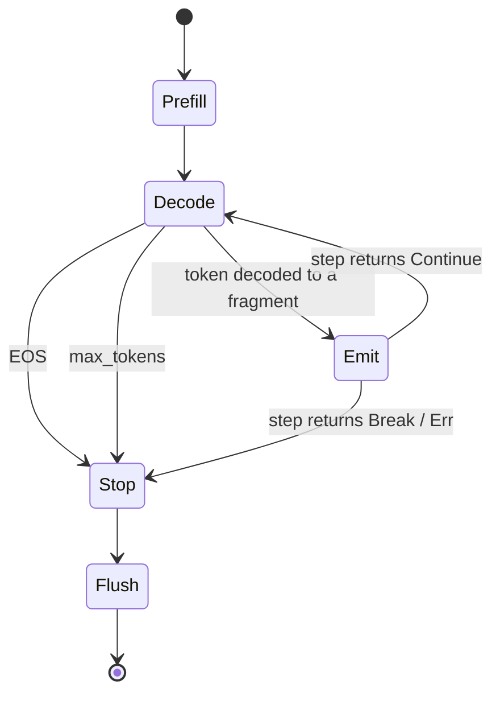

# yatima — design notes

`yatima` is a small Rust runtime for **language-integrated LLMs**: calling a
local model as an ordinary in-process function. That's a *building block*, not a
fixed product shape — embed it in an app, wrap it in a service, drive it from a
TUI, compose it however the work demands; the in-process function is the
foundation those are built on, not an alternative to them. We **own the runtime,
rent the engine** — `yatima-lib` owns loading, the generation loop, and (next)
capability-scoped tools; the inference engine
([candle](https://github.com/huggingface/candle)) is a swappable dependency, and
the lawful-composition algebra is rented from
[`axiom`](https://github.com/shayne-fletcher/axiom).

## Crates

- **`yatima-lib`** — the capability as a function: `Engine::{load, generate,
  generate_fold}`, `Sampling`/`GenOpts`/`Generation`/`StopReason`, the
  `RepoId`/`models_root`/`model_dir` resolver, the `presence`/`model_shards`
  discovery, and (behind the `fetch` feature) `ensure_model`.
- **`yatima-cli`** — a thin wrapper: `yatima generate` and `yatima models-dir`,
  with model selection parsed into a `ModelSource` ADT at the edge.

## Generation: an effectful fold (the contract)

`generate_fold` is the primitive; `generate` is the `acc = ()` specialization
that just streams fragments to a side-effecting callback.

```rust
fn generate_fold<A>(&mut self, prompt: &str, opts: &GenOpts, init: A,
    step: impl FnMut(A, &str) -> Result<ControlFlow<A, A>>) -> Result<(A, Generation)>;
```

The portable contract (what the later Haskell study reasons about):

- **Stateless per call** — the KV cache is cleared on entry; no conversation or
  cache retained across calls (GE-1).
- **Raw completion** — the prompt is fed as-is; no chat template.
- `step` receives **decoded text fragments** (not token ids), **in generation
  order**, via an incremental detokenizer (`TokenOutputStream`, a Mealy machine
  `state → token → (state, Option fragment)`).
- It returns `ControlFlow`: `Continue(acc)` keeps folding, `Break(acc)` stops
  voluntarily (`StopReason::Stopped`), `Err` is propagated. Generation also stops
  on EOS or `max_tokens` — **exactly one `StopReason` per run** (STOP-1), and
  `tokens ≤ max_tokens` (GEN-3).
- **Sampling** is an explicit choice (no `temperature ≤ 0` sentinel):
  `Sampling::Greedy` is deterministic and seed-free (SAM-2); `Sample
  { temperature, seed }` is seeded. Every `Sampling` maps to exactly one candle
  `LogitsProcessor` (SAM-1).

EOS ids are read from `config.json` / `generation_config.json` (a *set*, e.g.
DeepSeek's `<｜end▁of▁sentence｜>` = 151643) — never hard-coded strings.

**North star — a hylomorphism.** Generation *unfolds* a fragment stream (a
coalgebra deciding termination on EOS/max/break) and *folds* it with the caller's
`step` algebra: `generate = ana ; cata = hylo`. The recursion-scheme vocabulary
(`Functor`/`Fix`/`fold`) lives in `axiom::fix`; the hot loop stays imperative,
but this is the denotation the Haskell study formalizes.

## Model storage & loading

Weights are re-downloadable ⇒ they live under the XDG **cache**:

```
$YATIMA_MODELS_DIR  (else  ${XDG_CACHE_HOME:-~/.cache}/yatima/models)
  └── <org>/<name>/        # = model_dir(models_root(), &RepoId)
        config.json  tokenizer.json  *.safetensors  [model.safetensors.index.json]
```

This mirrors the layout written by
[`possum`](https://github.com/shayne-fletcher/possum), our standalone Hugging
Face downloader: **possum acquires, yatima loads** — agreement by *convention,
not coupling* (MS-2). `Engine::load` is HF-agnostic (takes a directory).

- **`RepoId`** is a validated newtype: a `--repo` id (untrusted input) is parsed
  rejecting empty / absolute / `..` / empty-component ids, so `model_dir` cannot
  escape the root (MS-3). The same `is_safe_relative` check guards shard names
  read from the (untrusted) index `weight_map`.
- **`model_shards`** is the single discovery rule used by both `Engine::load`
  (what to mmap) and `presence` (what must exist): index `weight_map` values when
  present (deduped, sorted, contained), else all `*.safetensors` (MD-1/MD-2).
- **`presence(dir) -> { complete, missing }`** is the receive frontier:
  `complete` is the conjunction (axiom's `bool` meet — the `All` lattice) over
  `config.json`, `tokenizer.json`, and every shard. A partial shard set is never
  a false cache hit; `missing` names what's absent.

## Auto-fetch (the `fetch` feature)

`yatima generate --repo <id>` fetches on a cache miss by calling
[`possum-lib`](https://github.com/shayne-fletcher/possum) in-process (no shelling
out): cache hit → quiet load; miss → `ensure_model` downloads (include
`*.safetensors`/`*.json`, exclude `figures/*`, `ProgressMode::Auto`), **re-checks
`presence`** (FETCH-2: never hand a partial dir to `load`), then loads;
`--offline` never touches the network; `--model <dir>` bypasses resolution.

## Acquisition as a delivery guarantee

The possum↔yatima boundary is, in [`relay`](https://github.com/shayne-fletcher/relay)'s
two-halves vocabulary, a **reliable-delivery** correspondence — two complementary
halves, *no shared runtime object*, joined only by the on-disk layout + index
manifest (relay's `Frame`/`Session`):

| relay (Haskell) | yatima acquisition |
|---|---|
| send half (`Outbox`, retransmit) | possum — selection + atomic `.incomplete`→rename (never release a torn frame) |
| receive **frontier** (`ReceiverHalf`) | `presence` — the releasable set = `All` over required files |
| cumulative **ack** (`Inbox.ackFrontier`) | `ensure_model`'s post-download re-check (incomplete ⇒ error/NAK) |
| duplicate **dedup** (`n < expected`) | cache-hit idempotence (ACQ-2 / FETCH-2) |
| end-to-end guarantee | present ⟹ loadable (ACQ-3 / MD-3) |

Laws: **ACQ-1** atomic release (no torn frame), **ACQ-2** cache-hit idempotence,
**ACQ-3** present ⟹ loadable. relay is the Haskell sibling of this algebra.

## Registries

These are stated, not enforced by the compiler; each is protected by a test.

**Invariants**
- **MS-1** `models_root` precedence: `$YATIMA_MODELS_DIR` → `$XDG_CACHE_HOME/
  yatima/models` → `$HOME/.cache/yatima/models`.
- **MS-2** `model_dir` mirrors possum's `<root>/<org>/<name>`.
- **MS-3** repo ids & shard names never escape the root/model dir.
- **MD-1/2** discovery: unsharded = all `*.safetensors`; indexed = unique
  `weight_map` values (deduped, sorted).
- **FETCH-2** `ensure_model` re-checks presence; a partial dir never reaches
  `load`.
- **CLI-1** exactly one model source (`--model` xor `--repo`); **CLI-2**
  `--offline` never fetches.

**Laws**
- **SAM-1** `Sampling` → `LogitsProcessor` total; **SAM-2** greedy ignores seed.
- **STOP-1** exactly one `StopReason`; **GEN-3** `tokens ≤ max_tokens`.
- **GE-1** stateless: repeated greedy runs on the same engine+prompt are
  byte-identical.
- **DISC** indexed shards dedupe idempotently and are deterministically ordered;
  containment holds.
- **ACQ-1/2/3** above.

## State machines

Model acquisition / loading:

```mermaid
stateDiagram-v2
    [*] --> SourceSelected
    SourceSelected --> Present: is_model_present
    SourceSelected --> Missing: not present
    Missing --> Error: offline
    Missing --> Fetching: online
    Fetching --> Present: re-check presence
    Fetching --> Error: download failed / still incomplete
    Present --> Loaded: Engine::load
    Loaded --> [*]
```

Generation:



## References

- **Baseline to exceed:** Anil Madhavapeddy, *"Language Integrated LLMs as an
  OCaml Function"* — https://anil.recoil.org/notes/language-integrated-llms. We
  benchmark against it and go beyond: a typed `generate` contract with stated
  laws, capability-scoped safe tools (next), and a Haskell formalization.
- **Algebra:** [`axiom`](https://github.com/shayne-fletcher/axiom) — the
  lawful-composition foundation (`All`/lattices, `Fix`/`fold`); influenced by
  `monarch-1/algebra`.
- **Delivery algebra (Haskell sibling):**
  [`relay`](https://github.com/shayne-fletcher/relay).

## Deferred

Capability-scoped tool runtime + agent loop + conversation state (the next
layer); engine swappability (mistral.rs / llama.cpp-GGUF); download
integrity/resume; porting `axiom`'s missing combinators (`Max`/`Min`/`All`/`Any`/
`LatticeMap`) from monarch; the Haskell study of the `generate` contract and the
acquisition correspondence.
