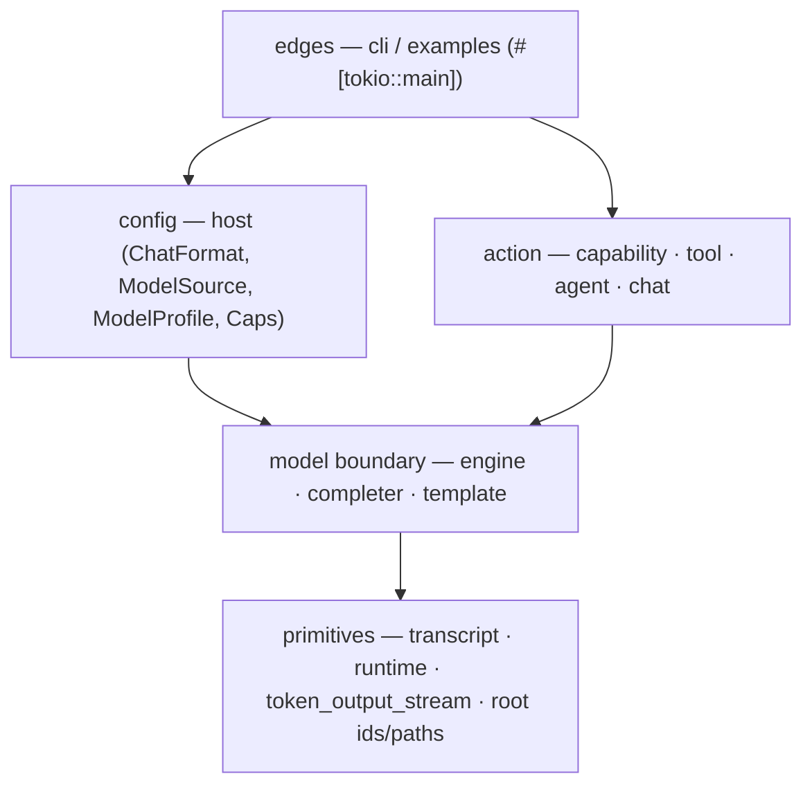
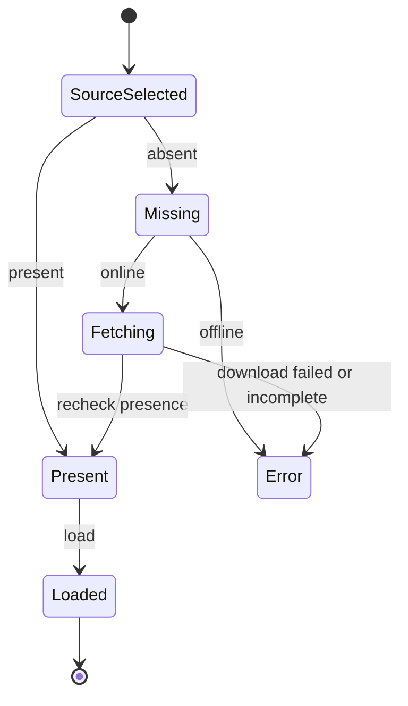
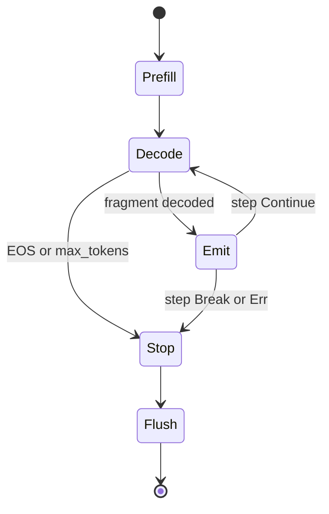

# yatima — design notes

This is the deep architecture record. The README is the public front door; this
note keeps the contracts, invariants, state machines, and hard-won design
details close to the code.

`yatima` is a small Rust runtime for **language-integrated LLMs**: calling a
local model as an ordinary in-process function and letting it act only through
explicit capabilities. That's a *building block*, not a fixed product shape —
embed it in an app, wrap it in a service, drive it from a TUI, compose it however
the work demands. We **own the runtime, rent the engine** — `yatima-lib` owns
loading, the generation loop, chat/session state, and capability-scoped tools;
the inference engine ([candle](https://github.com/huggingface/candle)) is a
swappable dependency.

## Crates

- **`yatima-lib`** — the capability as a function: `Engine::{load, generate,
  generate_with}`, `Sampling`/`GenOpts`/`Generation`/`StopReason`, the
  `ModelId`/`models_root`/`model_dir` resolver, the `presence`/`model_shards`
  discovery, and (behind the `fetch` feature) `ensure_model`. Plus the acting
  layer: the `Completer` model boundary, `Dir` capabilities, `Tool`/`Tools` with the
  `ToolCallCodec` protocol, and the `Agent` loop.
- **`yatima-cli`** — a thin wrapper: `yatima generate`, `yatima chat`, `yatima
  agent`, and `yatima models-dir`, with model selection parsed into a
  `ModelSource` ADT at the edge.
- **`yatima-protocol`** — the frontend wire plane, spelled once: `HostEvent`
  and `HostRequest`, plus `ModelInfo` and the `Channel`/`StopKind` mirrors of
  their `yatima-lib` namesakes. Serde-only and WASM-clean by construction —
  serve's browser client deserializes these, so nothing here may drag candle;
  `yatima-lib` is deliberately absent (the lib↔wire conversions live in
  `yatima-host`). Its `PROTO-2` law: every variant round-trips losslessly, the
  enums are externally tagged and `#[non_exhaustive]`, and no variant is
  `untagged` (which would make wire evolution ambiguous).
- **`yatima-host`** — the engine-facing host every frontend shares. A dedicated
  **engine thread** owns the `Engine` *and* the `ChatSession`/`Agent` (the one
  authoritative history) for its whole life (`HOST-3`) and calls the sync
  decode shims — local decode is `!Send` on the blocking island (CMP-1/RT-2), so
  it cannot run in a `tokio::spawn`. It serves chat-only formats as a plain
  streaming session and tool-trained formats as a sessionful agent from turn
  one, with the web toolset, the CAP-3 grant wording, the budget knobs
  (`knobs.rs`), and file logging (`init_file_logging`) all single-sourced here.
  Two planes connect it to a frontend — a `std::sync::mpsc` **request** plane
  (`HostRequest`) and a `tokio::sync::mpsc` **event** plane (`HostEvent`, the
  frontend's only transcript truth, rendered as a *mirror*) — plus an
  out-of-band **`CancelGate`**: the host owns each turn's `Cancel` and arms the
  gate with it before decoding, so a frontend trips it mid-decode (the request
  queue is unserviced while decoding; the decode loop polls per token and stops
  at the next boundary — `StopKind::Stopped`, partial output kept). Its laws:
  `HOST-1` frontends drive turns only through the protocol (none constructs an
  `Agent`/`ChatSession`), `HOST-2` the grant/refusal wording lives only here,
  `HOST-3` one thread owns the `!Send` engine, `HOST-4` tool activity crosses
  the wire as `(ToolNoteKind, payload)` — clipping is host policy, but the
  marker vocabulary (the TUI's `✓`/`✗`, egui's glyph-safe `ok`/`failed:`) is
  each view's own. Native only — it drags `yatima-lib`; the WASM client
  consumes only `yatima-protocol`.
- **`yatima-tui`** — an interactive terminal UI (`ratatui`/`crossterm`), a thin
  view over `yatima-host` kept a separate crate so its UI deps never touch the
  lean CLI. It holds only a render *mirror* rebuilt from `HostEvent`s plus
  input/scroll/status; Esc trips the host's `CancelGate` for the in-flight turn.
  Its own `TUI-N` invariant registry (cursor-bounds, pure-render, single-append,
  ui-liveness, reasoning-foldable, prompt-cancel, single-in-flight) is in the
  crate doc. Built in slices: Slice 1 chat + streaming + reasoning split, Slice 2
  foldable reasoning + context meter, Slice 3 Esc cancellation.
- **`yatima-gui`** — the GPU frontend (egui/eframe, wgpu → Metal): the same thin
  view over `yatima-host`, so the model cannot tell hosts apart because there is
  one host. It renders the `HostEvent` stream as a markdown/texture transcript
  (`egui_commonmark`), with inline image artifacts — the host reads a plot/image
  artifact's bytes and ships them as `HostEvent::Image`, textured on receipt (an
  SVG rasterizes first, the one view concern kept here so it compiles into the
  coming WASM client). A pump thread wakes egui as host events arrive.
  Decorative animation is behind `--whimsy` (off by default).
- **`yatima-serve`** — the native bridge that draws nothing: it owns a
  `yatima-host` `HostHandle` exactly as the GUI does and carries the two planes
  to a browser over one WebSocket (the vision's rung 2). Its laws: `SRV-1`
  binds only an explicit, specific address — the unspecified forms, including
  the IPv4-mapped wildcard, are refused so nobody exposes a session beyond the
  tailnet by accident; `SRV-2` the wire is exactly the `yatima-protocol` enums
  as externally-tagged JSON, so serve defines no message types of its own;
  `SRV-3` one client at a time (a second is refused 409), the event stream
  survives disconnect and resumes on reconnect with at-least-once delivery at
  the seam, and a session always ends (send cap + keepalive) so the one stream
  always comes back. Native only (it drags `yatima-host`/candle); the browser
  client depends on `yatima-protocol` alone.
- **`yatima-text`** — host-neutral prettification of model output (the LaTeX
  → Unicode pipeline, fence-aware). Deliberately dependency-free, pure std,
  WASM-clean: every frontend — TUI, GUI, serve's browser client — runs the
  same pass, and it must compile anywhere they do. Extracted from the TUI's
  renderer when the GUI became its second consumer; `yatima-lib` (candle,
  tokenizers, reqwest) can never be its home.

## Module layering (LAYER-1)

One law underlies several boundary fixes: **dependencies point *down* this DAG,
and a type lives at the lowest layer that needs it.** A lower layer never depends
on a higher one. This is the rule that, stated, catches a whole class of
organic-growth bug at review time — `template`/`chat` once imported `Turn` from
`agent`; `engine` once carried a `ChatFormat`-shaped `Caps`. Both were *upward*
dependencies; both are now fixed by moving the type to its altitude.



An arrow is "may depend on". Reading it: **primitives** (`transcript` = `Role`/
`Turn`, `runtime` = the one bridge + island, `token_output_stream`, the
`ModelId`/`model_dir` resolver) depend on nothing in-crate. The **model boundary**
(`engine`, `completer`, `template`) sits on primitives (`completer` over
`engine`). **config** (`host`) and **action** (`capability` → `tool` →
`agent`/`chat`) are *siblings* — both consume the boundary, neither depends on the
other (the agent never imports `host`; `host` never imports the agent). The
**edges** (CLI, examples) sit on top and may use everything.

Enforcement: within one crate the compiler permits any module to `use` any
other, so LAYER-1 is a *stated* law — held by review and the cheap
relocate-on-catch discipline (the `Turn` move was a single commit). A future
multi-crate split (e.g. extracting `transcript`/`lexicon` — see Roadmap) would
make it compiler-enforced; deferred until there is a real trigger.

## Three layers

The runtime exposes three increasing-capability modes over the same `Engine`:

- **`generate`** — raw completion, no chat template. The primitive.
- **`chat`** — instruction-following: apply the model's native chat template (no
  tools). Renders a transcript via a `PromptTemplate` (`--format
  qwen|gemma|mistral|plain`) then streams `Engine::generate`. One-shot with
  `--prompt`; **omit it for an interactive multi-turn session** (reads stdin;
  `/exit` quits, `/reset` clears). Conversation memory comes from re-rendering the
  whole growing transcript each turn — the `Engine` stays stateless per call, so
  history lives in the prompt, not the KV cache. This is the layer that makes an
  *instruct* model behave as trained — without it, raw text underperforms.
- **`agent`** — the tool loop, for **tool-trained** models only.

The split matters because **chat needs only a chat template, but agent needs the
model to be trained to emit tool calls** — two different bars. Gemma-2 clears the
first, not the second. Capability by model family:

| Model family      | generate | chat  | agent/tools |
|-------------------|----------|-------|-------------|
| Qwen2.5-Instruct  | yes      | yes   | yes         |
| GLM-4 (9B / 32B)  | yes      | yes   | no          |
| Gemma-2-it        | yes      | yes   | no          |
| Mistral-v0.3      | yes      | yes   | later/complex |
| TinyLlama-chat    | yes      | yes   | no          |
| StarCoder2        | yes      | maybe | no          |

Chat templates omit a literal BOS when the model's tokenizer adds one
(Gemma `<bos>`, Mistral `<s>` via `TemplateProcessing`) — never double-BOS
(TMPL-1); models without a system role fold system text into the first user turn
(TMPL-2).

### The reasoning channel (REASON-1)

Reasoning models (Kimi-Dev, Qwen3, the DeepSeek-R1 family) emit an inline
chain-of-thought before their answer, wrapped in model-specific markers
(`<think>…</think>`; Kimi's special-token `◁think▷…◁/think▷`). That span is
**ephemeral**: it must not be surfaced as the answer, and — crucially — must not
re-enter the transcript that is re-rendered into the next prompt, or the model
re-reads its own stale reasoning off-distribution. (DeepSeek's *own* chat
template enforces exactly this, dropping history reasoning via
`content.split('</think>')[-1]` — so REASON-1 is the model authors' contract, not
ours alone.)

`split_reasoning` (`reasoning.rs`) is the pure split at the completion→turn
boundary: `{ reasoning, answer }` over a `DIALECTS` table, the identity when no
marker is present (safe for any model). `Agent` and `ChatSession` store only the
answer in history and surface the trace out-of-band (`AgentEvent::Reasoning`,
`ChatSession::last_reasoning`). `Turn::content` therefore never holds a reasoning
span.

For *streaming*, `ReasoningSplitter` is the incremental dual: it classifies each
fragment as `Channel::Reasoning` or `Channel::Answer` as it arrives (handling a
marker split across fragment boundaries), so a UI can fold/dim the trace — the
CLI chat REPL dims it. The channel enum is intentionally binary: reasoning vs.
answer is the complete partition for what streams today (chat has no tools); a
`ToolCall` arm is a non-breaking addition for if the agent ever streams or a
harmony-style multi-channel model is enabled.

A model whose cue **pre-seeds** the opener (DeepSeek renders
`<｜Assistant｜><think>`) emits only the *close* marker; both the pure split
(close-without-open) and the streaming splitter (`ReasoningSplitter::seeded`,
selected via `ChatFormat::pre_seeds_reasoning`) handle that. Reasoning models
also need a larger token budget — they spend the default 256 mid-thought — so a
profile marked `reasoning: true` floors `max_tokens` at `REASONING_MIN_TOKENS`
(raising only, never reducing a larger caller budget).

**Marker semantics are set, not toggle.** A real model can emit a marker more
than once (a degenerating model re-emitting `</think>`), so the streaming
splitter treats every recognized marker as *setting* the channel
(open→reasoning, close→answer) and always consumes it — a stray or duplicate
marker is never leaked into a channel. (A *toggle* would let the second close,
seen while already in the answer, slip through — the bug a synthetic
double-close unit test now pins, plus a gated e2e that streams a real distill.)
Both splitters draw their dialects from one `DIALECTS` table, so batch and
streaming never drift.

**Observability (taps).** The split is instrumented so its state is never opaque:
`tracing::trace!` fires on every streaming channel transition (`marker`, `opens`,
`was/now_reasoning`) and on each batch split (dialect + per-channel char counts) —
OBS-compliant (trace level, counts not content). Programmatic taps: the agent
emits `AgentEvent::Reasoning`, `ChatSession::last_reasoning()` exposes the last
trace, and the `ReasoningSplitter` callback (`Channel`, `&str`) is itself the
streaming tap a host renders.

## Generation: an effectful fold (the contract)

`generate_with` is the primitive; `generate` is the `acc = ()` specialization
that just streams fragments to a side-effecting callback.

```rust
fn generate_with<A>(&mut self, prompt: &str, opts: &GenOpts, init: A,
    step: impl FnMut(A, &str) -> Result<ControlFlow<A, A>>) -> Result<(A, Generation)>;
```

The portable contract (what the later Haskell study reasons about):

- **Stateless per call** — the KV cache is cleared on entry; no conversation or
  cache retained across calls (GE-1).
- **Raw completion** — the prompt is fed as-is; no chat template.
- `step` receives **decoded text fragments** (not token ids), **in generation
  order**, via an incremental detokenizer (`TokenOutputStream`, a Mealy machine
  `state → token → (state, Option fragment)`).
- It returns `ControlFlow`: `Continue(acc)` keeps folding, `Break(acc)` stops
  voluntarily (`StopReason::Stopped`), `Err` is propagated. Generation also stops
  on EOS or `max_tokens` — **exactly one `StopReason` per run** (STOP-1), and
  `tokens ≤ max_tokens` (GEN-3).
- **Sampling** is an explicit choice (no `temperature ≤ 0` sentinel):
  `Sampling::Greedy` is deterministic and seed-free (SAM-2); `Sample
  { temperature, seed }` is seeded. Every `Sampling` maps to exactly one candle
  `LogitsProcessor` (SAM-1).

EOS ids are read from `config.json` / `generation_config.json` (a *set*, e.g.
DeepSeek's `<｜end▁of▁sentence｜>` = 151643) — never hard-coded strings.

## Observability

`yatima-lib` emits structured `tracing` spans and events; applications decide how
to collect them. The CLI installs a small `tracing-subscriber` layer driven by
`RUST_LOG`, but the library never installs a global subscriber. This keeps Yatima
embeddable: a service, TUI, notebook bridge, or Python wrapper can attach its
own subscriber without fighting the runtime.

The discipline is borrowed from Hyperactor:

- **Fields, not prose.** Use typed fields such as `arch = ?engine.arch()`,
  `backend = %engine.backend()`, `tool = %call.name`, `outcome = ?outcome`,
  `prompt_tokens`, and `prefill_chunk`. The message string names the event; the
  fields carry the data.
- **No accidental payload capture.** Instrumented functions should use
  `skip_all` or explicit spans/fields. Do not log prompts, generated text,
  tool arguments, SEC payloads, auth tokens, or whole structs at info level.
- **Spans for duration, events for facts.** `model.load`, `engine.generate`,
  prefill chunks, and `tool.call` are duration-bearing operations. `loaded
  model`, `generation finished`, `tool finished`, and `agent run finished` are
  facts about those operations.
- **Async spans must be attached to futures.** Do not hold a `span.enter()` guard
  across `.await`; use `#[tracing::instrument(skip_all, fields(...))]` or
  `future.instrument(span).await`.
- **Info stays sparse.** Per-chunk and per-tool-detail records are debug-level;
  per-token tracing is deferred until there is a concrete profiling need.
- **Perfetto later, same events.** Perfetto should arrive as a subscriber/layer
  over this field vocabulary, not as a second ad-hoc instrumentation system.

### Prefill scheduling

The first generation step can either feed the whole prompt to the model at once
or split it into bounded prefill chunks. The public knob is
`GenOpts::prefill_chunk`:

- `None` — use the model/backend default.
- `Some(0)` — force one full-prompt prefill.
- `Some(n)` — feed at most `n` prompt tokens per prefill forward pass.

Chunking does not change the logical prompt or the generated-token loop: each
chunk advances the same KV cache with the correct `start_pos`, and the final
prefill logits are taken from the last prompt token. It is therefore a scheduling
choice, not a prompt transformation.

Why it exists: GLM-4-32B GGUF on Metal was observed to produce incoherent output
on a long structured SEC research prompt when evaluated as one full prefill.
The same model, prompt, tokenizer, and sampler produced coherent output when the
prefill was bounded; forcing `prefill_chunk = 0` reproduced the bad output.
Source comparison with llama.cpp suggests this is the same broad concern that
llama.cpp avoids through bounded batch/ubatch evaluation rather than requiring a
single giant prompt prefill. Yatima therefore defaults GLM-4 GGUF on Metal to a
64-token prefill chunk, while preserving the explicit override for benchmarking,
diagnosis, and future Candle-side fixes.

**Gated on F32 dtype (PREFILL-1).** The Metal chunk default applies *only* when
the runtime dtype is F32. Chunked prefill on a **BF16/F16** model crashes:
Candle's attention produces F32 K/V at `seqlen_offset > 0` (every chunk after the
first), which cannot `cat` onto the BF16 KV cache the first chunk laid down —
`dtype mismatch in cat, lhs: BF16, rhs: F32`. It surfaces mid-conversation, once
the re-rendered transcript first exceeds one chunk (~64 tokens). So a BF16
safetensors model prefills in one shot (numerically fine — verified), while F32
models (GGUF dequant; F32 safetensors) keep chunking for the precision reason
above. The decision is a pure function (`prefill_chunk_for(arch, is_metal,
dtype)`), unit-tested model-free as the CI regression guard, with a gated e2e
(`lib/tests/prefill_dtype_repro.rs`) driving a >1-chunk prompt through a real
BF16 model.

**North star — a hylomorphism.** Generation *unfolds* a fragment stream (a
coalgebra deciding termination on EOS/max/break) and *folds* it with the caller's
`step` algebra: `generate = ana ; cata = hylo`. The hot loop stays imperative;
this is the denotation, not the implementation — the recursion-scheme reading is
what the (planned) Haskell study formalizes.

## Acting: capability-scoped tools & the agent loop

If `generate_with` folds *tokens* into a value, the agent loop folds *turns*: the
model emits a tool call, a capability-scoped tool runs, its result is fed back,
and the loop repeats until the model answers or `max_steps` is reached (the
hylomorphism nests one level up). Model turns are sequential, but tool execution
is async: a caller can await the result, watch lifecycle/progress events, join
the task, or request cooperative cancellation. The loop is still provable against
a *scripted* `Completer` with no GPU.

The design is **small composable boundaries**, simplest concrete impl behind each:

- **`Completer`** (the model boundary) — `complete(prompt, opts, stops) ->
  Completion { text, stop }`, stopping at EOS / `max_tokens` / a stop string,
  with the stop marker **included** so the codec sees the whole block. `Engine`
  implements it over `generate_with`; tests use a canned `Completer`. This is
  also the engine-swap boundary (mistral.rs / llama.cpp would be another impl).
- **`Dir`** (authority as a value) — a rooted filesystem capability;
  `resolve(rel)` rejects escapes via the same `is_safe_relative` check as
  `ModelId` (MS-3 / CAP-1). A tool *holds* its capabilities; we never hand it
  ambient `std::fs`.
- **`Tool` / `Tools`** — a tool advertises a `ToolSpec` (JSON-Schema params, the
  de-facto standard) and runs `async call(args, ctx)`. `Tools::dispatch_async`
  **never hard-errors**: an unknown name (AGENT-2), invalid arguments,
  cancellation, or a tool failure becomes a typed `ToolOutcome`; `ToolResult` is
  only the model-facing projection the transcript receives (PROTO-1).
  `Tools::spawn` returns a `ToolTask` with `ToolEvent`s, `join`, and cooperative
  cancellation. Current tools: `ReadFile`, `ListDir`, `WriteFile`, `ReadUrl`,
  `ReadPage`, `ReadImage`, `Plot`, and `SendNotification`, each holding its
  own capability.
  `ReadUrl` returns a body **verbatim** (JSON/plaintext/APIs); `ReadPage` fetches
  an HTML page under the same `WebOrigin` capability and returns the **readable
  main article** (title + text) via a readability pass (`dom_smoothie`),
  async-first: the body is streamed under a hard size cap (never buffered then
  measured), the CPU extraction runs on `spawn_blocking`, output is truncated to
  a char budget rather than failing, and obvious non-HTML is rejected with a
  "use read_url" message. Server-rendered HTML only — no JS, paywalls, or
  cross-origin links. Long articles page **model-drivenly**: each window's
  truncation marker names the `offset` for the next call, and continuations are
  served from a per-tool fetch-once cache (FETCH-1/WIN-1) — one network fetch
  per URL per session, which is the shape a throttled host (sieve's EDGAR)
  requires: re-fetching is the expensive act, re-reading is free. The first
  window's header lists the readable region's images (absolute, alt-labeled,
  capped) — the discovery seam feeding `read_image`; header metadata rides
  single-newline lines so the window tiling law is untouched.
- **`ReadImage`** fetches an image (SVG/PNG/JPEG) from the granted origins
  and saves it as a viewable artifact (IMG-1): content-type gate with a
  magic-byte sniff for silent servers, streamed size cap, output confined to
  a `WriteDir` at a content-hash name. Hosts display it in their idiom —
  the GUI as an inline texture (SVGs rasterized host-side via `resvg`, pure
  Rust, WASM-clean), the TUI via the platform viewer. Note the CAP-2
  honesty: a page's images often live on a different origin (Wikipedia's
  files are on `upload.wikimedia.org`) — reading the page does not grant the
  image host; the model is taught to ask.
- **`Plot`** renders charts (line/bar/scatter/hist) to PNG via a
  matplotlib-bearing python held as a `PlotSandbox` capability. The model never
  writes code (PLOT-1): it submits a declarative spec against a **closed
  schema** — unknown fields, unknown kinds, and anything code-shaped are typed
  rejections — and the interpreter runs only the library's fixed generator.
  Data arrives three ways: literal series, a **function of x** (`expr`:
  `sin(x) * exp(-x/10)` — parsed and sampled *host-side in Rust* against a
  closed grammar of numbers, `x`, `pi`, `e`, arithmetic, and a whitelisted
  function alphabet, so symbolic intent has a legal channel and python still
  receives only literal arrays; the grammar is total, bounded, and
  property-tested `parse ∘ print = id`; range bounds accept **constant**
  expressions in the same grammar — `"to": "9 * pi"` — because models speak
  trig ranges symbolically), or a **host-registered dataset**
  named by the program. Output is confined to the sandbox (PLOT-2) at a
  spec-hash filename, so rendering is deterministic per machine (PLOT-3) and
  a plot can be journaled like any other evidence. Rejections teach: schema
  and grammar errors quote the legal expr form, because a local model reads
  tool errors as its instructions for the retry.
- **`Tool` is a downstream extension point.** `Tool` is `pub` and `Tools::with`
  takes any `impl Tool`, so a consumer crate (e.g. `sieve`) can define and
  register its own domain tools — they implement `Tool` (needs the `async-trait`
  dep) and live in the crate that already depends on `yatima-lib` (e.g.
  `sieve-cli`), keeping the engine-free core engine-free. The toolset is composed
  by the host; the engine bundles none by default (sandbox-by-omission, AGENT-2).
- **`PromptTemplate`** (the chat format) — renders the transcript into the
  model's *native* prompt string. `ChatMlTemplate` (Qwen2.5), `PlainTemplate`
  (fallback/tests). A model is acutely sensitive to its trained format; the wrong
  one degenerates it.
- **`ToolCallCodec`** (the protocol) — `QwenToolCall` (ChatML/Hermes
  `<tool_call>{json}</tool_call>` with `arguments`) and `JsonToolCall` (a plain
  convention, for tests / the `plain` fallback). `parse` returns
  `None` (a plain answer), `Some(Ok)` (a call), or `Some(Err)` (malformed ⇒ an
  error turn), and is **panic-proof on any input** (proptest). Each does strict
  JSON first, then a **tolerant** pass that recovers common real-model defects
  (an unquoted name, braces inside string values) — this is the actual line of
  defense for tool-call validity (constrained decoding was tried and shelved; see
  Deferred).
- **`Agent`** — `run_async` collects the final answer; `run_with_async` is the
  fold an actor/TUI streams `AgentEvent`s into (`run_async` is the `acc = ()`
  specialization). Synchronous `run` / `run_with` wrappers remain for simple
  callers. Bounded by `max_steps`; `AgentStop` is `Final` / `MaxSteps` /
  `Stopped` (the last when the caller's fold returns `ControlFlow::Break`).
- **Sessionful (AGENT-3).** Successive `run`s form one conversation: each
  completed exchange persists its user turn and final answer into the agent's
  history and is re-rendered into later prompts; tool rounds and reasoning stay
  ephemeral to their run (the working-matter analogue of REASON-1 — a 40k-char
  `read_page` result must not ride along in every later prompt). Interrupted or
  step-exhausted runs persist nothing, so the caller can simply re-ask. One-shot
  use (the CLI) is the fresh-agent-per-run special case.
- **Hosted by the TUI, authorized at runtime (CAP-3).** Sessions launch with
  zero web authority — no flag. Authority derives only from user utterances:
  a URL typed in a message auto-grants its origin for the session
  (`origins_in` scans *only* user-typed text — a URL inside fetched content
  mints nothing), and `/grant`, `/grants`, `/revoke` manage the set
  explicitly. Grants accumulate into a shared, growable `WebOrigins`
  (CAP-2 generalizes to the origin *set*) held by `read_url`/`read_page`;
  while empty, the web tools omit themselves from the advertised specs, and
  once granted their descriptions enumerate the set (CAP-3a — the prompt
  always states the model's true authority). `/reset` clears conversation,
  not grants. A tool-trained format serves **one sessionful agent from turn
  one**: pre-grant, the model sees exactly the no-authority tools (plot) —
  with zero advertised tools a codec renders zero tool-calling instructions
  (CAP-3a all the way down) — and a grant surfaces the web tools
  mid-session. `/grant` mints authority; it is not a mode switch. (The
  earlier chat→agent transplant is gone: plotting needed no web authority
  and was hostage to web ceremony.) Chat-only formats keep the plain chat
  path and refuse grants. Agent decodes **stream** (AGENT-4):
  classified fragments arrive live — reasoning and tool activity on the
  `Reasoning` channel (tool rounds are working matter, so the reasoning pane
  is their honest home), answer prose on `Answer` — with codec markup
  withheld from the answer by the opener gate, and cancellation landing at
  **token** granularity on both paths (TUI-6). A step that turns out to be a
  tool call retracts its streamed narration from the answer pane and replays
  it as reasoning, ahead of the ⚙ activity line. Chat-only formats refuse
  grants with a clear message (CAPS-1). `Tool` is the downstream extension
  seam: a consumer crate (e.g. a sieve CLI) registers its own domain tools
  via `Tools::with` and gets the same hosting for free.

**Speaking the model's native format (hard-won).** Getting a base model to
*reliably* act took three corrections, each now a guarded invariant:
- **Detokenization must be faithful.** Streaming decode emits a fragment unless
  the text ends in U+FFFD (an unfinished byte sequence) — the canonical TGI/vLLM
  condition. candle's example heuristic (emit on a trailing alphanumeric) buffers
  punctuation and, on a stop, drops it — silently truncating tool-call JSON
  (`"`, `}`, `</tool_call>`). A weights-free round-trip test pins this.
- **Repetition penalty is per-call.** ~1.1 keeps prose from degenerating
  (repeated words) but mangles structured JSON punctuation; it is a `GenOpts`
  knob, kept on (prose) and absorbed for tool calls by the tolerant parser.
- **Model choice matters.** R1 distills were trained on reasoning, not
  tool-calling, and won't emit tool calls even when shown the format; Qwen2.5
  (Qwen2 arch, loads unchanged) is trained for it and is the agent default.

Tool-call *validity* is handled by native format + tolerant parsing (constrained
decoding was tried and did not earn its keep — see Deferred). Free-text answer
*quality* (e.g. a 7B greedily misreading a value back) is a separate, model-bound
concern that neither addresses.

**Honesty (where we partially, not wholly, match Anil's ocap story).** Rust gives
*capabilities by construction + enforced containment*, not Eio's
language-enforced object-capabilities. The enforced parts: a tool not in the
agent's set is uncallable (sandbox by omission, AGENT-2), and a `Dir`-scoped path
is containment-checked (CAP-1). The convention part: tools are written against
capability handles, not ambient effects. The capability model — little
agent-market precedent (MCP ≈ "trust the server"; function-calling has no
capability notion) — is the part worth owning; its lineage is ocap *systems*
(Eio, WASI Preview 2, Pony/E).

**Interop.** Schemas and roles follow the de-facto standard (JSON-Schema params;
system/user/assistant/**tool** turns) rather than reinvent. MCP is a different
problem — a transport for *out-of-process* tool servers; later it can ride the
same boundaries at the edge (consume an MCP server *as* a `Tool`, or expose our tools
*as* an MCP server), without changing the in-process core.

## Model storage & loading

Weights are re-downloadable ⇒ they live under the XDG **cache**:

```
$YATIMA_MODELS_DIR  (else  ${XDG_CACHE_HOME:-~/.cache}/yatima/models)
  └── <org>/<name>/        # = model_dir(models_root(), &ModelId)
        config.json  tokenizer.json  *.safetensors  [model.safetensors.index.json]
```

This mirrors the layout written by
[`possum`](https://github.com/shayne-fletcher/possum), our standalone Hugging
Face downloader: **possum acquires, yatima loads** — agreement by *convention,
not coupling* (MS-2). `Engine::load` is HF-agnostic (takes a directory).

- **`ModelId`** is a validated newtype: a `--repo` id (untrusted input) is parsed
  rejecting empty / absolute / `..` / empty-component ids, so `model_dir` cannot
  escape the root (MS-3). The same `is_safe_relative` check guards shard names
  read from the (untrusted) index `weight_map`.
- **`model_shards`** is the single discovery rule used by both `Engine::load`
  (what to mmap) and `presence` (what must exist): index `weight_map` values when
  present (deduped, sorted, contained), else all `*.safetensors` (MD-1/MD-2).
- **`presence(dir) -> { complete, missing }`**: `complete` is the conjunction
  over `config.json`, `tokenizer.json`, and every shard, so a partial shard set
  is never a false cache hit; `missing` names what's absent.

### Supported architectures

`Engine::load` dispatches on the model's architecture rather than assuming one.
`detect_arch` reads `config.json`'s `architectures` class name (and falls back to
`model_type`), then a private `CausalLm` trait gives the generation loop one
uniform `forward`/`reset` regardless of family. candle's models come in two
shapes: most self-manage a KV cache (`forward(ids, offset)` + `clear_kv_cache`);
**Llama** threads an external cache and has no clear (reset = rebuild it), and
returns last-token logits as `[1, vocab]` vs the others' `[1, 1, vocab]` — both
normalized by the single `last_token_logits` helper. Unsupported models fail with
a clear "unsupported architecture" error, not a serde mismatch.

Loadable today: **Qwen2, Qwen3, Qwen3-MoE, Llama, Mistral, Phi-3, Gemma-2,
Gemma-3, StarCoder2, GLM-4, DeepSeek-V2/V3** (safetensors) plus
**GGUF/quantized** Qwen2, Qwen3, Qwen3-MoE, Llama, Gemma-3, and GLM-4 (DeepSeek
is safetensors-only — candle has no quantized DeepSeek loader). This covers
*loading + `generate`* for all, and `chat` for those with a chat template
(Qwen/Gemma/GLM/Mistral/DeepSeek/QwenThink; the rest fall back to Plain); the
**agent** path still assumes the Qwen/ChatML tool format.

**Reasoning formats — pre-seed vs emit.** A reasoning model either *emits* the
`<think>` opener itself (Kimi's `◁think▷`; classified by the `new()` splitter) or
*pre-seeds* it in the prompt and emits only the closing `</think>` (DeepSeek,
QwQ-32B; classified by the `seeded()` splitter). A format declares which via
`ChatFormat::pre_seeds_reasoning`, and this MUST agree with whether its template
seeds `<think>` — a pure test (`pre_seeds_matches_template`) enforces it. QwQ-32B
is ChatML **+** a pre-seeded `<think>` (`ChatFormat::QwenThink` /
`ChatMlThinkTemplate`), distinct from plain `Qwen`; using plain `Qwen` for it
showed the reasoning *as the answer* (the bug this guard now prevents). A gated
e2e (`reasoning_profiles_surface_a_reasoning_channel`) runs each reasoning
profile and asserts its reasoning channel actually fires.

The R1 *distills* (DeepSeek-R1-Distill-Qwen/-Llama) are a subtlety: they are
Qwen2/Llama **arch** but trained on DeepSeek's **format**, so the arch default
(ChatML) mis-renders them. A host selects `deepseek` explicitly — the
`deepseek-r1` builtin profile does this — and the `DeepSeekTemplate` then renders
them natively (verified live: the distill answers cleanly with no `<|im_end|>`
leak that the ChatML mis-render produced).

A CI **consistency harness** (`arch_wiring_is_consistent_and_complete`) drives a
single `ALL_ARCHS` + exhaustive `arch_spec` table, asserting every arch's
detection / GGUF normalization / chat-format / Metal-prefill wiring agrees — so a
newly added `Arch` cannot compile until it is fully wired. The newest families
(Qwen3, Qwen3-MoE, Gemma-3) are **wired + harness-tested but not yet
runtime-validated with weights**; the DeepSeek format is runtime-validated via
the R1 distill (`lib/tests/coherence.rs`), though the genuine DeepSeek-V2/V3
*arch* (safetensors-only) is not.

GGUF caveat: candle reads standard quant types only (`Q4_0/1`, `Q5_0/1`, `Q8_0`,
`Q2_K`–`Q6_K`) — **no i-quants** (`IQ*`). A GGUF containing `IQ4_NL` etc. fails to
load (`unknown dtype 20`); use a standard-type or llama.cpp `--pure` quant. This
is why Kimi-Dev-72B runs only from its legacy `Q4_0` GGUF.

**GGUF / quantized.** A model dir with a single `*.gguf` takes the quantized
path: `Engine::load_gguf` reads the file's metadata for the architecture
(`general.architecture` → `quantized_qwen2` / `quantized_llama`) and EOS
(`tokenizer.ggml.eos_token_id`, unioned with any `<|im_end|>`/`<|endoftext|>` in
the vocab). The quantized model types fit the same self-cache `CausalLm` shape,
and quantized matmul runs on Metal — so a **32B-Q4** (~20 GB) runs on a 48 GB Mac,
the real lever for answer quality on long prose. **GGUF is self-contained:** the
tokenizer is built from the file's embedded `tokenizer.ggml.*` metadata
(candle-core's `TokenizerFromGguf`) — no sibling `tokenizer.json` needed (one is
used only if present). So `--repo <id> --gguf <file>` fetches a single file and
just works; `--model <dir>` also works for a local `.gguf`. Deferred: sharded
multi-file GGUF, more quantized arches.

## Auto-fetch (the `fetch` feature)

`yatima generate --repo <id>` fetches on a cache miss by calling
[`possum-lib`](https://github.com/shayne-fletcher/possum) in-process (no shelling
out): cache hit → quiet load; miss → `ensure_model` downloads (include
`*.safetensors`/`*.json`, exclude `figures/*`, `ProgressMode::Auto`), **re-checks
`presence`** (FETCH-2: never hand a partial dir to `load`), then loads;
`--offline` never touches the network; `--model <dir>` bypasses resolution.
Gated repos (e.g. Gemma) authenticate when `HF_TOKEN` is set in the environment
(passed to possum as a bearer token; unset → public-only, as before).

## Concurrency

Decode is sequential and compute-bound — token *n+1* depends on *n*, and the hot
loop does GPU/CPU work with nothing to await. So the **generation core stays
synchronous**: an `async fn generate` would be a lie that blocks the executor and
starves other tasks. Concurrency belongs to *delivery*, not decode.

The async form is therefore an **adapter over `generate_with`, not a second
engine path** — run the blocking fold on `spawn_blocking` and let `step` send
fragments down a bounded channel:

```rust
pub fn generate_events(engine, prompt, opts) -> mpsc::Receiver<Event>;
pub enum Event { Fragment(String), Done(Generation) }
```

Two properties fall out of choices already made:

- **Cancellation** — if the consumer drops the receiver, `blocking_send` fails,
  `step` returns `ControlFlow::Break`, and generation stops
  (`StopReason::Stopped`). This is why the `generate_with` primitive exists; the
  plain `generate` callback (`-> Result<()>`) can't express it.
- **Backpressure** — a *bounded* channel parks the decode thread when the
  consumer is slow, so generation tracks the client's pace.

Categorically: decode is the coalgebra (unfold), `step` the algebra (fold), and
the channel adapter is the natural transformation carrying a blocking fold into
an async stream — without touching the core.

Scope honesty: per-completion decode is sequential and GPU-bound; *cross-request*
parallelism is a batching/scheduling concern rented from the engine / a future
server, not faked here. One `Engine` (mutable KV cache, ~15 GB weights) is
one-generation-at-a-time.

Tool execution is different: tools are effectful boundary calls (filesystem,
HTTP, notifications, future process/MCP adapters), so the tool core is async.
`ToolCtx` carries lifecycle emission and cooperative cancellation; `Tools::spawn`
is the join/watch/cancel surface, while the agent normally awaits each typed
`ToolOutcome`, projects it to a model-facing `ToolResult`, and then proceeds to
the next model turn.

**Realized as `yatima-host`**: the durable engine-side shape is an **engine
actor** owning the `Engine` and serving requests over a channel — now the shared
host every frontend drives (see Crates), and the home for conversation/KV-cache
reuse and cross-request scheduling. It composes with the async tool runtime but
is not required to make tools awaitable/watchable.

### Runtime ownership & the sync↔async bridge (RT-1)

The library is **async-first** (the agent loop and tool dispatch are async) but
still offers thin **synchronous shims** for non-async embedders, and runs a
**synchronous inference core**. Rather than scatter `Handle::try_current` dances
and per-call runtimes, everything funnels through `runtime.rs`:

- **One owned multi-thread runtime** (a lazy `OnceLock<Runtime>`); the library
  never builds a runtime per call.
- **`block_on` — the single sync→async bridge.** Its ambient policy is explicit:
  no runtime → the owned runtime; a multi-thread runtime → `block_in_place` +
  the current handle (don't nest runtimes; keep other tasks progressing); a
  **current-thread runtime → panic with direction** ("call the async API"),
  because that case is genuinely unsupportable (no worker to hand off to; a
  nested `block_on` would deadlock). Every sync API (`Agent::run`,
  `Tools::dispatch`, `ensure_model_blocking`) is a one-line shim over its async
  primitive through this bridge.
- **`run_blocking` — the compute island.** Blocking work *whose result the async
  fn needs inline* (model inference inside the agent/chat loop) runs here:
  `block_in_place` on a multi-thread runtime so the executor stays live, a plain
  call otherwise. This is what un-paints the earlier half-paint, where the
  synchronous `complete()` sat directly in the async loop and starved tool
  watchers during generation.

`block_in_place` (not `spawn_blocking`) is correct for the inline case: the work
borrows `&mut Engine`/`&mut Completer`, which is neither `'static` nor `Send`, so
it can't be *moved* to a blocking pool — but it can relocate *other* tasks off
the worker. `spawn_blocking` + a bounded channel remains the right tool for the
*detached* streaming adapter sketched above (`generate_events`), where the work
is owned and the consumer wants a stream rather than an awaited result.

The binary edges (CLI + examples) are `#[tokio::main(flavor = "multi_thread")]`
and call the async APIs directly, so they dogfood the runtime rather than hide a
`block_on`; the sync shims exist for embedders that aren't async.

**The blocking island is type-enforced (RT-2).** "Inference must not block the
executor" is, stated literally, false — inference *does* block a thread. The
enforceable invariant is sharper: *local inference may be reached by an async
caller only through the runtime's blocking island.* We make that a compile-time
obligation with a borrow-scoped **capability witness**. `run_blocking_island`
mints a `BlockingIsland<'_>` (private field → unforgeable; HRTB lifetime → can't
escape the closure), and the `Engine` decode primitives (`complete_on`,
`complete_streaming_on`) *require* one. So `impl Completer for Engine` cannot be
written to decode on an async worker — the executor-stalling version does not
type-check. The low-level `generate_with` stays island-free on purpose: it is the
honest synchronous escape hatch for advanced callers. Types fix the *path*; the
operational *property* (liveness) rides on the multi-thread commitment and is
pinned by a liveness test (a ticker task progresses while a completion is in
flight). This is `Send`-gates-`spawn` for blocking: a witness that you are inside
the island gates the call, exactly as `Send` gates a cross-thread move.

### The model boundary is async, `Send` inferred per impl (CMP-1)

`Completer` is the effect boundary: prompt → completion. It is an **async** trait
so it generalizes past local blocking compute to a **remote/HTTP model** that is
fundamentally async I/O. The non-obvious, deliberate choice is *how* it is async:
**native `async fn` in trait** (Rust ≥ 1.75), **not** the `async_trait` crate.

Why that matters: with native `async fn`, the returned future's `Send`-ness is
**inferred per implementation** rather than fixed at the trait. The local
`Engine` owns GPU handles (`Box<dyn CausalLm>`, no `Send` bound) so its
completion future is naturally `!Send`; a remote completer captures only `Send`
state so its future is naturally `Send`. We thereby avoid *both* bad global
choices: `?Send` (strips `Send` from every completer, penalising the remote
case) and forcing `Engine: Send` (a lie about the rented engine that buys
nothing — it is one-generation-at-a-time and `block_in_place`-pinned anyway). The
`Send` decision lives where the truth is: each impl.

Each impl also owns the **operational shape** of the effect. Native `async`
alone does not make candle inference non-blocking — so `Engine::complete` runs
its sync decode under `run_blocking`; a remote completer instead `.await`s
network I/O. Callers (`Agent`, `ChatSession`) just `.await` and assume nothing
about whether completion is CPU- or I/O-bound; the synchronous `turn`/`run`
shims bridge through `runtime::block_on`.

This is the principled counterpart to `Tool`, and the contrast is the point:

| trait | shape | stored as | concurrency | mechanism |
|-------|-------|-----------|-------------|-----------|
| `Tool` | `dyn`-compatible | `Arc<dyn Tool>` | `tokio::spawn`ed, watched, cancelled across tasks | `#[async_trait]` + `Send` |
| `Completer` | generic, monomorphic | `Agent<C>` / `ChatSession<C>` | awaited inline, one at a time | native `async fn`, `Send` per impl |

Tradeoff, accepted: a public native-`async fn` trait trips
`clippy::async_fn_in_trait` (you cannot name a `Send` bound on the method). We
`#[allow]` it *because* completions are never spawned, so imposing a global
`Send` bound would be wrong, not merely unnecessary. The day an engine-actor
needs to move a completion across threads, that is when to reach for
return-type-notation or `trait_variant` — not before.

## Registries

The **canonical** invariant & law registry lives in the crate docs — see the
`yatima-lib` crate doc and the `yatima-cli` `main.rs` doc, and, for the frontend
stack, the `yatima-protocol` doc (**PROTO-2**, and **WASM-1**: it compiles for
`wasm32`), the `yatima-host` doc (**HOST-1/2/3**), the `yatima-tui` doc
(**TUI-1..7**), and the `yatima-serve` doc (**SRV-1/2/3**). Each is protected by
a test that cites its id in an `// upholds: <id>` comment (`grep -r
'upholds:'`).

In brief: model store & discovery (**MS-1/2/3**, **MD-1/2/3**, **EOS-1**,
**FETCH-1**, dedup/order under **DISC**); generation (**SAM-1/2**, **STOP-1**,
**GEN-3**, **GE-1**); agent & tools (**AGENT-1/2**, **TOOL-1/2**, **CAP-1/2**,
**PROTO-1**); observability (**OBS-1/2/3/4**); chat templates
(**TMPL-1/2**, **REASON-1**); CLI (**CLI-1/2/3**); the frontend host and its
wire plane (**HOST-1/2/3**, **PROTO-2**, **WASM-1**), the terminal UI
(**TUI-1..7**), and the WebSocket bridge (**SRV-1/2/3**).

## State machines

Model acquisition / loading:



Generation:



## References

- Anil Madhavapeddy, *"Language Integrated LLMs as an OCaml Function"* —
  https://anil.recoil.org/notes/language-integrated-llms. Kindred motivation for
  calling a local model as an ordinary in-process function.
- **Algebra (related, not a dependency):**
  [`axiom`](https://github.com/shayne-fletcher/axiom) — a lawful-composition
  library (`All`/lattices, `Fix`/`fold`). yatima doesn't depend on it today; it's
  the intended home for the recursion-scheme formalization (see the Haskell study
  in Deferred).

## Roadmap (future features)

Grouped by area; rough priority within each. Items marked *(lesson)* were tried
and deliberately shelved — the note records why so we don't repeat them.

### Chat
- **Markdown vs raw rendering, toggleable.** Both frontends render answers
  through a presentation stack (TUI: `tui-markdown` + the `yatima-text`
  prettify pass; GUI: `egui_commonmark` + prettify + image-link taming). A
  toggle (`/raw`, and a `/stats` checkbox in the GUI) should show the
  **verbatim** answer — no markdown, no LaTeX prettifying, no link taming —
  because sometimes the reader needs what the model actually emitted:
  debugging model behaviour (the `` and `\( 9\pi \)`
  episodes were only diagnosable from raw text), copying exact characters,
  or auditing the presentation layer itself. Doctrine fit: the transcript
  mirror gains a second, unfiltered view of the same truth — rendering is a
  *view* choice, never a mutation (the host's session is already the
  authority). Per-message would be a refinement; session-global toggle is
  the slice.
- **Context-length handling — a staged, robust progression.** The multi-turn
  REPL (and the agent loop sooner, via tool results) grows the transcript until
  it exceeds the model's window; today **nothing checks**, so the failure is
  *silent* — RoPE positions degrade, then KV/position errors. Give the local path
  simple, robust behaviour built **down a ladder**, each rung shippable on its
  own and the earlier rungs sufficient for most use:
  1. **Know the budget** — `Engine::context_length()` (engine-native fact, same
     shape as `arch()` / `default_prefill_chunk()`; sourced from GGUF
     `<arch>.context_length` / safetensors `max_position_embeddings`). **Done**
     (CTX-1): discovered in both load paths, exposed as an accessor.
  2. **Detect + fail clean** — before a turn, `token_count(prompt) + max_tokens`
     vs `context_length`; a typed error / `StopReason`, never silent garbage.
     This rung alone fixes the real bug — it is a *correctness signal*, not a
     feature. **Done** (CTX-1): `generate_with` refuses an over-budget prompt
     before decode via the `within_context` guard.
  3. **Trim (evict oldest)** — keep the system turn + the most-recent turns that
     fit. Deterministic and lossy; covers most chat pain. **Done** (COMPACT-1 /
     HOST-5): `ChatSession::trim_history_to` / `Agent::trim_history_to` drop
     whole committed exchanges (user+assistant pairs) oldest-first until the
     remaining history fits a token budget — the seeded system prompt and the
     newest `keep_last` exchanges protected, alternation never broken — and the
     host trims between turns (never mid-run) back under a low-water mark
     (`depth_ceiling − max_tokens − TOOL_HEADROOM`, the ceiling tightened to the
     Metal KV validated depth), always announcing the drop on the Note plane.
     *Live validation still owed*: unit-proven, but no real session has yet
     crossed the low-water mark — an ordinary tool session can't (tool tokens
     are ephemeral across runs, AGENT-3; a 10-turn read_page/image session
     committed ~2k tokens against an ~8k mark). Smoke it by temporarily
     lowering `METAL_KV_VALIDATED`, then one long-prose marathon at the real
     ceiling. That session's trim-frequency/dropped-size data also settles
     rung 4's summary budget and knob default.
  4. **Summarize (compaction)** — fold the evicted prefix into one synthetic turn
     *via the `Completer` itself* (the local analog of server-side compaction);
     heaviest and lossiest, gated on real long-session use. *On trigger* — rung 2
     of `plans/context-compaction.plan.md`, layered on the returned dropped turns
     of rung 3; not yet built, and not before rung 3's live validation (above).
     Hard requirements already specced in the plan: the summary passes the same
     degeneracy gate as any answer (it is the only model text that enters
     history without streaming past the user), its source prompt is
     budget-checked, Submit/Cancel during compaction is defined in code, and
     the knob starts OFF everywhere.
  - Agent-specific rung: **elide old tool-result payloads** (keep "called
    `read_file` → ok", drop the body) — the analog of context-editing, cheaper
    than summarizing prose, since tool output is the actual bloat. *On trigger*
    (already ephemeral across runs — AGENT-3 — so this rung only matters
    within one deep run).

  Layering (LAYER-1): the *budget* is an engine fact (`context_length`); the
  *policy* lives in `ChatSession`/`Agent` and the host — the engine never
  decides what to drop. **CTX-1** (rungs 1–2, built): the context window is
  discovered from config and a turn never sends more than `context_length`
  tokens — over-budget is rejected before decode, never silently truncated by
  the backend. **COMPACT-1 / HOST-5** (rung 3, built): the *mechanism* (which
  turns to drop, deterministically) is in the lib; the *policy* (when to trim,
  to what budget, and telling the user) is in the host. Rung 4 (summarize) layers
  on top, on trigger. (`generate` one-shot and short chats rarely hit this; the
  `embed` classify loop `reset()`s per item, so it never grows.)
- **Build stamp in both frontends.** Embed `git describe --always --dirty`
  at build time (a `build.rs`, no new deps) and surface it in the GUI
  title/`/stats` and the TUI status line. Parallel sessions across two
  frontends plus uncommitted working trees made "does the window I'm
  testing contain the fix?" the single most re-asked question of
  2026-07-04 — a glanceable stamp answers it. Pairs with a habit: a fix
  that lands in one frontend either rides shared code (`yatima-text`'s
  `user_label` is the pattern) or gets a parity line here.
- **Readline niceties** — line editing + history (e.g. `rustyline`); the loop is
  plain `stdin` today.
- **Conversation persistence** — save/load a session transcript.
- **Reasoning-model think handling** — **Done** (REASON-1): `split_reasoning`
  separates the chain-of-thought at the completion→turn boundary across every
  marker dialect; chat/agent store answer-only history and surface the trace
  out-of-band; the REPL dims the streamed reasoning via `ReasoningSplitter`. See
  "The reasoning channel" above.

### Tools / agent
- **Constrained decoding** *(lesson)* — a top-K JSON-prefix masking prototype was
  built and reverted: generic JSON validity forces *structure* but not *meaning*,
  so Qwen2.5 shifted to a valid-prefix-but-wrong run-on string the tolerant
  parser misreads — net **worse** than the parser alone. The real fix is
  **schema-aware** masking (the `name` constrained to a prefix of a real tool
  name, forcing the closing quote on match; arguments to the param schema). Only
  worth doing schema-aware. Addresses tool-call *validity* only, never free-text
  quality.
- **Native Mistral tool codec** (`[TOOL_CALLS]` / `[AVAILABLE_TOOLS]`) — a second
  tool-trained family in the agent; complex (special-token detok, 9-char IDs).
- **Index-based `read_image` — take URL fidelity away from the model.** One
  live session produced the whole failure taxonomy: mis-copied thumbnail
  URLs (HTTP 400), *constructed* thumbnail URLs with invented hash
  directories (HTTP 400 — the paths are unguessable by design), and
  re-fetches of already-shown files. The listing should number its entries
  and `read_image` should accept `{"image": 3}` against the session's last
  `[images]` list, with the URL form kept for direct user-supplied targets.
  Kills the class by construction instead of by teaching text. Design
  question to settle first: how `ReadPage` and `ReadImage` share the
  listing (they are separate `Tool`s today; the seam is deliberate).
  Follows the night of 2026-07-04: IMG-2 (typed artifact events,
  content-hash fetch-once) fixed re-display; this is the remaining
  discovery half.
- **`read_page` find-in-page — promoted; sieve's reasons, not chat's.**
  `{"url": …, "find": "going concern"}` returning the window(s) around
  matches plus where the other matches live. The memo pipeline's model job
  is reading long filings (the 8-K before the buy, offering language)
  under a 12k-char window and the Metal depth ceiling; sequential paging
  demands planning initiative a local model lacks, while *asking for what
  it needs* is the one initiative-shaped thing instruct models do
  reliably — the same move as `{"image": N}`: delete the job the model
  fails at. Own design pass first: multi-match shape, case folding, cache
  and budget interaction.
- **`read_page` link discovery.** List the page's outbound article links
  the way images are listed (numbered, filtered, capped-with-a-spoken-
  tail), so "find me more on X" has a structural next hop instead of a
  constructed URL. Secondary to find-in-page.
- **Richer capabilities** — process capabilities and tools, plus multi-tool-per
  turn / planning. `WriteDir`, `WebOrigin`, and `NtfyTopic` are now present as
  first slices of the broader capability model.
- **MCP edge adapter** — consume an MCP server *as* a `Tool`, or expose our tools
  *as* an MCP server (out-of-process; rides the same boundaries at the edge).

### Models / engine
- **Engine swappability** — cross-arch dispatch + GGUF/quantized + self-contained
  GGUF tokenizers are **done**. Remaining: sharded multi-file GGUF + more
  quantized arches; other backends (mistral.rs, llama.cpp) via more `Completer`
  impls.
- **Remote `Completer` (Anthropic / OpenAI)** — the payoff of the async-`Completer`
  generalization (CMP-1): a `RemoteCompleter` holds only `Send` state, so its
  future is naturally `Send` (per-impl inference, no `?Send`), and it **awaits
  HTTP directly** — no `run_blocking`, no `BlockingIsland` (RT-2 gates only the
  local sync decode). Rust has no official Anthropic SDK, so use raw `reqwest`
  (already a dep) against `POST /v1/messages`: headers `x-api-key` +
  `anthropic-version: 2023-06-01`; body `{model, max_tokens, system?, messages,
  stop_sequences?}`; model ids bare (`claude-opus-4-8`, …, no date suffix);
  `complete_streaming` reads SSE `content_block_delta` → `text_delta` onto
  `on_token`; budget via `POST /v1/messages/count_tokens` + response `usage`.
  Three real impedance points to design around, not gloss:
  1. **Stop sequences aren't echoed.** Our `Completer` contract *includes* the
     matched stop marker (so a `ToolCallCodec` sees `</tool_call>`); the Messages
     API omits it on `stop_reason: "stop_sequence"`. The impl must re-append it.
  2. **`temperature`/`top_p` are 400s on current Claude models.** `Sampling`
     doesn't forward 1:1 — drop it, or map "more/less thinking" onto `effort`.
  3. **The boundary passes a flat prompt string; the chat API wants structured
     `messages`.** A first cut sends the rendered prompt as one `user` message
     (works, loses role structure). Doing it well is the boundary refinement below.
  Also: handle `stop_reason: "refusal"` before reading content. A flat-prompt,
  greedy-only remote completer is buildable today with no boundary surgery.
  **Scope decision (deliberate): a remote `Completer` is chat/generate, text
  only — no tools.** Our tools live in the `Agent` loop via a *text* codec gated
  to local tool-trained formats (Qwen/Plain); a hosted model's **native** tool
  use (`tool_use`/`tool_result` blocks, `stop_reason: "tool_use"`) cannot ride
  the flat-string `Completer` boundary and would need a separate "agent backend"
  abstraction (most likely letting the provider run its own tool loop). That is
  explicitly **kicked down the road** — do not conflate it with the `Completer`.
- **More chat templates** — Llama-3, Zephyr/TinyLlama (same shape as Gemma/Mistral).
- **Sampling quality** — `top_p`/`top_k` nucleus sampling (only temperature
  today) for better free-text on smaller models; download integrity/resume.
- **Model-analysis suite + REASON-2 hardening** — onboarding a new model today
  means discovering undocumented facts by *live trial* (pre-seed vs emit `<think>`,
  whether reasoning markers are *special* tokens — the bug where QwQ's `</think>`
  was dropped by `skip_special_tokens` and the answer was mislabeled reasoning
  forever, the EOS set, quant dtype, footprint, format). Build a `yatima inspect`
  (static: GGUF metadata + tokenizer only, no GPU — arch, context length, quant
  dtype + candle support so `IQ*`/"unknown dtype 20" is caught before a 20 GB
  download, EOS ids, memory estimate vs this machine per MEM-1/2, and a **marker
  audit**: run each reasoning dialect marker through the *real* `TokenOutputStream`
  and report whether it survives) and a gated `yatima probe` (tiny generation:
  reasoning span present? pre-seed vs emit? does the answer channel actually flip?
  degeneration?). The two together emit a **draft `ModelProfile`** for a human to
  review and paste (advisory, like `invariant_reviewer`, never auto-merged). The
  marker-audit logic does double duty as the hardening: **REASON-2** — a load-time
  canary (`tracing::warn` when a configured model would drop a marker under the
  stream's decode) plus a test sweep over cached models asserting markers survive.
  So the suite *is* the hardening, productized — not a one-off check.

### Embedding (library surface)
- **`ChatSession` — done.** The multi-turn fold is a public lib type
  (`ChatSession<C: Completer, T: PromptTemplate>`, borrows the completer like
  `Agent`), exercised by `lib/examples/embed.rs` (a real non-CLI consumer:
  conversation + model→`enum`→native branch) and dogfooded by the CLI's one-shot
  `chat`. This is what makes "language-integrated" a demonstrated fact.
- **Streaming `Completer` — done.** `Completer::complete_streaming` adds a
  token-callback variant with a default impl (emit the whole completion once, so
  every existing `Completer` keeps working); `Engine` overrides it to forward each
  decoded fragment as it arrives. `ChatSession::turn_streaming` streams a turn
  through it, and the CLI's interactive `chat` REPL now drives a `ChatSession`
  end-to-end (the hand-rolled loop is gone) — so the CLI fully dogfoods the
  library on both the one-shot and streaming paths.
- **A TUI chat app (sometime soon).** A "ChatGPT-style" terminal app to prove
  out and play with capabilities interactively — the next real consumer after
  the examples, and the natural **forcing function**: a long interactive session
  is exactly what exercises streaming chat end-to-end *and* surfaces the
  context-length ladder (rungs 1–2 become essential the moment you chat past
  the window). It would also be where agent/tool capabilities get hands-on play.
  Drives demand for: the context-length rungs above, readline niceties, and
  eventually the engine-actor (if it grows beyond one session). Stays a pure
  embedder over `ChatSession`/`Agent` — no library changes it needs that aren't
  already wanted.

### Architecture / research
- **Invariant reviewer example — done.** `lib/examples/invariant_reviewer.rs`
  gathers bounded git/file/test-citation context in Rust and asks an in-process
  chat model for a cited report. This is the first "Yatima helps improve Yatima"
  slice: advisory, not patch-writing. Git is host-side evidence gathering here;
  a future interactive agent should get explicit `GitStatus`/`GitDiff`
  capabilities rather than ambient shell access.
- **Async `yatima-host`** — the current host owns the `Engine` on one thread and
  serves one session synchronously; the evolution wraps `run_with_async` for
  cross-request concurrency and KV-cache reuse (see Concurrency).
- **Structured-message `Completer` boundary** — `complete` takes a *rendered prompt
  string* today, which suits a local model fed one prompt but loses role
  structure for a hosted chat API (Anthropic/OpenAI take `messages[]`, not a
  flat string). A richer boundary would hand the completer the structured turns
  (`&[Turn]`) and let each impl render: local impls run their `PromptTemplate`,
  a remote impl maps turns → API `messages`. Trigger: the remote `Completer`
  above — until then the flat string is fine. **Prerequisite done:** `Role`/`Turn`
  now live in a neutral `transcript` module (were in `agent`), so the boundary would
  not make the model layer depend upward into the agent layer.
- **Serving & scale (deferred — mostly a different *process/tier*, not a
  module).** `yatima-lib` is the in-process **leaf**; serving concerns must not
  leak into it (no auth/tenancy/routing in `Engine`/`ChatSession`/`Agent`). The
  map, by where each concern lives:
  - *Node concurrency* (many clients, one model) → **`yatima-host`** (owns the
    `Engine`, serves requests over a channel; home of KV reuse). A request queue
    gives modest concurrency cheaply; real throughput needs continuous batching —
    a large engine build, probably **rented** (see fork).
  - *Tenancy / auth / quotas / multi-client API* → a separate **service tier**
    (e.g. `yatima-serve`) mapping tenant → capabilities → budget → model. Builds
    on the capability primitive (`Dir`/`WriteDir`/`WebOrigin`/`NtfyTopic` —
    bounded effects are exactly what isolation needs); never enters the library.
    **Live trigger (2026-07): remote collaboration on sieve** — serving yatima
    to a second user. The seam is now built: `yatima-host` owns the engine and
    speaks `yatima-protocol`, so serve is a socket speaking that protocol.
    Everything below (engine, tools, python) stays native; the client plane is
    the GUI's view half (decode, textures, egui) compiled to WASM over
    `yatima-protocol`, with artifacts (plot PNGs) crossing as `HostEvent::Image`
    bytes. The in-process hardening — real agent turns, the shared toolset, and
    the protocol/host extraction that made "consistent by parallel implementation"
    into "consistent by construction" — is done; serve is the remaining edge.
  - *Clusters / routing / model placement* → a **control-plane** tier above the
    service; the library is the leaf and knows nothing of it.
  - *Model sharding* → engine-internal, **rented from candle/backend**, surfaced
    as a load fact (like device/dtype), not a yatima subsystem.
  LAYER-1 extends one tier up: each serving tier is a new *edge* depending
  **down** into the library, never up. **Identity fork:** yatima as *embedded
  library / orchestrator* (scale by composing rented backends behind remote
  `Completer`s — vLLM / TGI / llama.cpp-server / cloud) **vs** yatima as *serving
  engine* (continuous batching — far larger, lower-level). The remote `Completer`
  is the escape hatch: front a real serving engine and let yatima orchestrate.
  The async runtime (RT-1/RT-2), `Send`-per-impl `Completer` (CMP-1),
  `yatima-host` (the extracted engine host) with `yatima-protocol` (its wire
  plane), and capability scoping are the concrete substrate the service tier
  builds on.
- **`lexicon` crate** — a shared, dependency-light home for `ModelId` + the
  `<root>/<org>/<name>` layout, extracted once there's a real trigger (possum
  validating its own ids, or a second consumer).
- **The Haskell study** — formalize the `generate` and agent contracts
  (GE/STOP/AGENT/CAP/PROTO/TMPL as propositions); the planned home for the
  recursion-scheme reading and `axiom`.
- **A GPU frontend (the "render anything" direction).** The terminal frontend
  has hard ceilings — no glyph shaping, RTL, proportional layout, typeset math,
  or inline media; the emulator owns all of that. (Felt sharply when the model
  wrote yatima's own name in Arabic, يَتِيمَة, which a TTY cannot shape — it
  briefly signed the idle TUI title before being dropped as clutter.) The answer is a
  **separate** frontend, not a TTY upgrade: a sibling edge (`yatima-gui`) over
  `yatima-host`, sharing the protocol planes with the TUI (the host is
  frontend-agnostic by construction now — HOST-1). Rust build path,
  not a Haskell port: `wgpu` + `cosmic-text`/`glyphon` for shaped/bidi text,
  `egui`/`makepad` for imgui-style controls, MSDF for crisp scaling. Beyond
  rendering, the deeper bet is **live-tweak / incremental recomputation** — a
  CBPV base where bindings are FRP cells and a salsa-style engine recomputes only
  consequences (an always-consistent notebook; incremental LLM pipelines where a
  changed prompt/param reruns one model call, not ten), with bounded memoization
  (Kirisame-style cost eviction, matching MEM-1/2) and identity-tracked
  interpolative animation for provenance ("see what came from what"). Prior art:
  Ed Kmett's `codex`/Cadenza (commercialized as Enso) and acko.net/MathBox.
  Large, separable, gated on a real trigger (typeset math, non-Latin scripts,
  inline plots); the TUI stays the default. Detailed working notes live in the
  (ephemeral, untracked) `plans/text-rendering.plan.md`.
