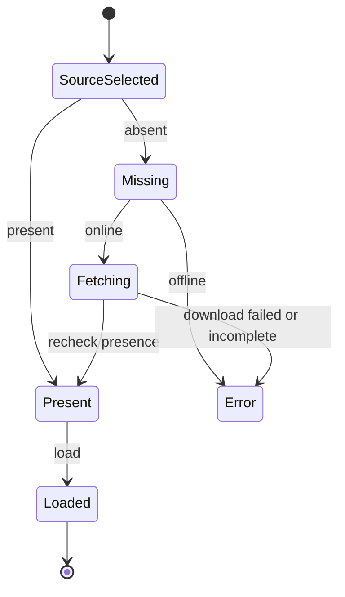
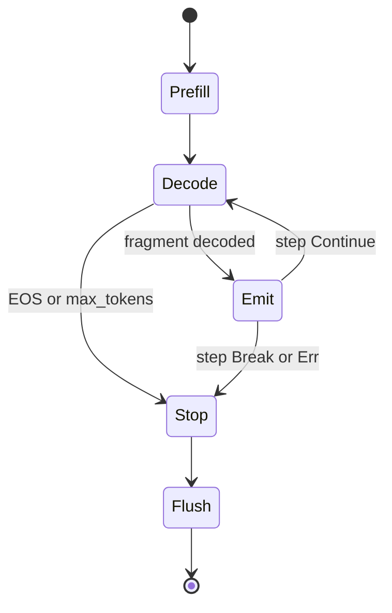

# yatima — design notes

`yatima` is a small Rust runtime for **language-integrated LLMs**: calling a
local model as an ordinary in-process function. That's a *building block*, not a
fixed product shape — embed it in an app, wrap it in a service, drive it from a
TUI, compose it however the work demands; the in-process function is the
foundation those are built on, not an alternative to them. We **own the runtime,
rent the engine** — `yatima-lib` owns loading, the generation loop, and
capability-scoped tools; the inference engine
([candle](https://github.com/huggingface/candle)) is a swappable dependency, and
the lawful-composition algebra is rented from
[`axiom`](https://github.com/shayne-fletcher/axiom).

## Crates

- **`yatima-lib`** — the capability as a function: `Engine::{load, generate,
  generate_with}`, `Sampling`/`GenOpts`/`Generation`/`StopReason`, the
  `ModelId`/`models_root`/`model_dir` resolver, the `presence`/`model_shards`
  discovery, and (behind the `fetch` feature) `ensure_model`. Plus the acting
  layer: the `Completer` model seam, `Dir` capabilities, `Tool`/`Tools` with the
  `ToolCallCodec` protocol, and the `Agent` loop.
- **`yatima-cli`** — a thin wrapper: `yatima generate`, `yatima agent`, and
  `yatima models-dir`, with model selection parsed into a `ModelSource` ADT at
  the edge.

## Generation: an effectful fold (the contract)

`generate_with` is the primitive; `generate` is the `acc = ()` specialization
that just streams fragments to a side-effecting callback.

```rust
fn generate_with<A>(&mut self, prompt: &str, opts: &GenOpts, init: A,
    step: impl FnMut(A, &str) -> Result<ControlFlow<A, A>>) -> Result<(A, Generation)>;
```

The portable contract (what the later Haskell study reasons about):

- **Stateless per call** — the KV cache is cleared on entry; no conversation or
  cache retained across calls (GE-1).
- **Raw completion** — the prompt is fed as-is; no chat template.
- `step` receives **decoded text fragments** (not token ids), **in generation
  order**, via an incremental detokenizer (`TokenOutputStream`, a Mealy machine
  `state → token → (state, Option fragment)`).
- It returns `ControlFlow`: `Continue(acc)` keeps folding, `Break(acc)` stops
  voluntarily (`StopReason::Stopped`), `Err` is propagated. Generation also stops
  on EOS or `max_tokens` — **exactly one `StopReason` per run** (STOP-1), and
  `tokens ≤ max_tokens` (GEN-3).
- **Sampling** is an explicit choice (no `temperature ≤ 0` sentinel):
  `Sampling::Greedy` is deterministic and seed-free (SAM-2); `Sample
  { temperature, seed }` is seeded. Every `Sampling` maps to exactly one candle
  `LogitsProcessor` (SAM-1).

EOS ids are read from `config.json` / `generation_config.json` (a *set*, e.g.
DeepSeek's `<｜end▁of▁sentence｜>` = 151643) — never hard-coded strings.

**North star — a hylomorphism.** Generation *unfolds* a fragment stream (a
coalgebra deciding termination on EOS/max/break) and *folds* it with the caller's
`step` algebra: `generate = ana ; cata = hylo`. The recursion-scheme vocabulary
(`Functor`/`Fix`/`fold`) lives in `axiom::fix`; the hot loop stays imperative,
but this is the denotation the Haskell study formalizes.

## Acting: capability-scoped tools & the agent loop

If `generate_with` folds *tokens* into a value, the agent loop folds *turns*: the
model emits a tool call, a capability-scoped tool runs, its result is fed back,
and the loop repeats until the model answers or `max_steps` is reached (the
hylomorphism nests one level up). It is synchronous (turns are sequential and
compute-bound, per the concurrency note) and provable against a *scripted*
`Completer` with no GPU.

The design is **small composable seams**, simplest concrete impl behind each:

- **`Completer`** (the model seam) — `complete(prompt, opts, stops) ->
  Completion { text, stop }`, stopping at EOS / `max_tokens` / a stop string,
  with the stop marker **included** so the codec sees the whole block. `Engine`
  implements it over `generate_with`; tests use a canned `Completer`. This is
  also the engine-swap seam (mistral.rs / llama.cpp would be another impl).
- **`Dir`** (authority as a value) — a rooted filesystem capability;
  `resolve(rel)` rejects escapes via the same `is_safe_relative` check as
  `ModelId` (MS-3 / CAP-1). A tool *holds* its capabilities; we never hand it
  ambient `std::fs`.
- **`Tool` / `Tools`** — a tool advertises a `ToolSpec` (JSON-Schema params, the
  de-facto standard) and runs `call(args)`. `Tools::dispatch` **never
  hard-errors**: an unknown name (AGENT-2) or a tool failure becomes an
  `is_error` `ToolResult` the model can recover from (PROTO-1). First tools:
  `ReadFile`, `ListDir` (read-only).
- **`PromptTemplate`** (the chat format) — renders the transcript into the
  model's *native* prompt string. `ChatMlTemplate` (Qwen2.5), `DeepSeekR1Template`
  (R1 distills), `PlainTemplate` (fallback/tests). A model is acutely sensitive to
  its trained format; the wrong one degenerates it.
- **`ToolCallCodec`** (the protocol) — `QwenToolCall` (ChatML/Hermes
  `<tool_call>{json}</tool_call>` with `arguments`), `DeepSeekToolCall` (native
  `<｜tool▁call…｜>` framing), `JsonToolCall` (a plain convention). `parse` returns
  `None` (a plain answer), `Some(Ok)` (a call), or `Some(Err)` (malformed ⇒ an
  error turn), and is **panic-proof on any input** (proptest). Each does strict
  JSON first, then a **tolerant** pass that recovers common real-model defects
  (an unquoted name, braces inside string values) — this is the actual line of
  defense for tool-call validity (constrained decoding was tried and shelved; see
  Deferred).
- **`Agent`** — `run` collects the final answer; `run_with` is the fold a future
  actor/TUI streams `AgentEvent`s into (`run` is the `acc = ()` specialization).
  Bounded by `max_steps`; `AgentStop` is `Final` / `MaxSteps` / `Stopped` (the
  last when the caller's fold returns `ControlFlow::Break`).

**Speaking the model's native format (hard-won).** Getting a base model to
*reliably* act took three corrections, each now a guarded invariant:
- **Detokenization must be faithful.** Streaming decode emits a fragment unless
  the text ends in U+FFFD (an unfinished byte sequence) — the canonical TGI/vLLM
  condition. candle's example heuristic (emit on a trailing alphanumeric) buffers
  punctuation and, on a stop, drops it — silently truncating tool-call JSON
  (`"`, `}`, `</tool_call>`). A weights-free round-trip test pins this.
- **Repetition penalty is per-call.** ~1.1 keeps prose from degenerating
  (repeated words) but mangles structured JSON punctuation; it is a `GenOpts`
  knob, kept on (prose) and absorbed for tool calls by the tolerant parser.
- **Model choice matters.** R1 distills were trained on reasoning, not
  tool-calling, and won't emit tool calls even when shown the format; Qwen2.5
  (Qwen2 arch, loads unchanged) is trained for it and is the agent default.

Tool-call *validity* is handled by native format + tolerant parsing (constrained
decoding was tried and did not earn its keep — see Deferred). Free-text answer
*quality* (e.g. a 7B greedily misreading a value back) is a separate, model-bound
concern that neither addresses.

**Honesty (where we partially, not wholly, match Anil's ocap story).** Rust gives
*capabilities by construction + enforced containment*, not Eio's
language-enforced object-capabilities. The enforced parts: a tool not in the
agent's set is uncallable (sandbox by omission, AGENT-2), and a `Dir`-scoped path
is containment-checked (CAP-1). The convention part: tools are written against
capability handles, not ambient effects. The capability model — little
agent-market precedent (MCP ≈ "trust the server"; function-calling has no
capability notion) — is the part worth owning; its lineage is ocap *systems*
(Eio, WASI Preview 2, Pony/E).

**Interop.** Schemas and roles follow the de-facto standard (JSON-Schema params;
system/user/assistant/**tool** turns) rather than reinvent. MCP is a different
problem — a transport for *out-of-process* tool servers; later it can ride the
same seams at the edge (consume an MCP server *as* a `Tool`, or expose our tools
*as* an MCP server), without changing the in-process core.

## Model storage & loading

Weights are re-downloadable ⇒ they live under the XDG **cache**:

```
$YATIMA_MODELS_DIR  (else  ${XDG_CACHE_HOME:-~/.cache}/yatima/models)
  └── <org>/<name>/        # = model_dir(models_root(), &ModelId)
        config.json  tokenizer.json  *.safetensors  [model.safetensors.index.json]
```

This mirrors the layout written by
[`possum`](https://github.com/shayne-fletcher/possum), our standalone Hugging
Face downloader: **possum acquires, yatima loads** — agreement by *convention,
not coupling* (MS-2). `Engine::load` is HF-agnostic (takes a directory).

- **`ModelId`** is a validated newtype: a `--repo` id (untrusted input) is parsed
  rejecting empty / absolute / `..` / empty-component ids, so `model_dir` cannot
  escape the root (MS-3). The same `is_safe_relative` check guards shard names
  read from the (untrusted) index `weight_map`.
- **`model_shards`** is the single discovery rule used by both `Engine::load`
  (what to mmap) and `presence` (what must exist): index `weight_map` values when
  present (deduped, sorted, contained), else all `*.safetensors` (MD-1/MD-2).
- **`presence(dir) -> { complete, missing }`**: `complete` is the conjunction
  (axiom's `bool` meet — the `All` lattice) over `config.json`, `tokenizer.json`,
  and every shard, so a partial shard set is never a false cache hit; `missing`
  names what's absent.

## Auto-fetch (the `fetch` feature)

`yatima generate --repo <id>` fetches on a cache miss by calling
[`possum-lib`](https://github.com/shayne-fletcher/possum) in-process (no shelling
out): cache hit → quiet load; miss → `ensure_model` downloads (include
`*.safetensors`/`*.json`, exclude `figures/*`, `ProgressMode::Auto`), **re-checks
`presence`** (FETCH-2: never hand a partial dir to `load`), then loads;
`--offline` never touches the network; `--model <dir>` bypasses resolution.

## Concurrency

Decode is sequential and compute-bound — token *n+1* depends on *n*, and the hot
loop does GPU/CPU work with nothing to await. So the **core stays synchronous**:
an `async fn generate` would be a lie that blocks the executor and starves other
tasks. Concurrency belongs to *delivery*, not decode.

The async form is therefore an **adapter over `generate_with`, not a second
engine path** — run the blocking fold on `spawn_blocking` and let `step` send
fragments down a bounded channel:

```rust
pub fn generate_events(engine, prompt, opts) -> mpsc::Receiver<Event>;
pub enum Event { Fragment(String), Done(Generation) }
```

Two properties fall out of choices already made:

- **Cancellation** — if the consumer drops the receiver, `blocking_send` fails,
  `step` returns `ControlFlow::Break`, and generation stops
  (`StopReason::Stopped`). This is why the `generate_with` primitive exists; the
  plain `generate` callback (`-> Result<()>`) can't express it.
- **Backpressure** — a *bounded* channel parks the decode thread when the
  consumer is slow, so generation tracks the client's pace.

Categorically: decode is the coalgebra (unfold), `step` the algebra (fold), and
the channel adapter is the natural transformation carrying a blocking fold into
an async stream — without touching the core.

Scope honesty: per-completion decode is sequential and GPU-bound; *cross-request*
parallelism is a batching/scheduling concern rented from the engine / a future
server, not faked here. One `Engine` (mutable KV cache, ~15 GB weights) is
one-generation-at-a-time.

**Deferred** (build when a real async client exists): the durable shape is an
**engine actor** owning the `Engine` and serving `(prompt, opts, reply)` requests
over a channel — also the home for conversation/KV-cache reuse and the agent
loop, so concurrency and the capability-scoped tool runtime are the *same* future
component.

## Registries

The **canonical** invariant & law registry lives in the crate docs — see the
`yatima-lib` crate doc (`lib.rs`: model store/discovery + generation) and the
`yatima-cli` `main.rs` doc (`CLI-1`/`CLI-2`). Each is protected by a test that
cites its id in an `// upholds: <id>` comment (`grep -r 'upholds:'`).

In brief: model store & discovery (**MS-1/2/3**, **MD-1/2/3**, **EOS-1**,
**FETCH-1**, dedup/order under **DISC**); generation (**SAM-1/2**, **STOP-1**,
**GEN-3**, **GE-1**); agent & tools (**AGENT-1/2**, **CAP-1/2**, **PROTO-1**);
CLI (**CLI-1/2**).

## State machines

Model acquisition / loading:



Generation:



## References

- Anil Madhavapeddy, *"Language Integrated LLMs as an OCaml Function"* —
  https://anil.recoil.org/notes/language-integrated-llms. Kindred motivation for
  calling a local model as an ordinary in-process function.
- **Algebra:** [`axiom`](https://github.com/shayne-fletcher/axiom) — the
  lawful-composition foundation (`All`/lattices, `Fix`/`fold`); influenced by
  `monarch-1/algebra`.

## Deferred

**Constrained decoding** — *tried and shelved; see the lesson.* A top-K
JSON-prefix masking prototype was built and reverted: generic JSON validity
forces *structure* but not *meaning*, so Qwen2.5 just shifted to a
valid-prefix-but-wrong run-on string (`{"name": "read_file, "arguments"…}`) that
the tolerant parser then misreads — net **worse** than the parser alone. The
real fix is **schema-aware** masking (the `name` value constrained to a prefix of
an actual tool name, forcing the closing quote on match; arguments to the param
schema). Worth doing only as that schema-aware slice, not generic-JSON-first. The
tolerant parser is the default path; it handles the observed defects. (Note:
constrained decoding only ever addresses tool-call *validity*, never free-text
answer quality.)

**Engine swappability** — two axes: (a) cross-architecture inside candle via a
config-dispatched `Model` enum (Llama / Mistral / Phi / Gemma + GGUF
`quantized_*`) — today only Qwen2 loads, so a fetched R1-Distill-Llama-8B is
parked here; (b) other backends (mistral.rs, llama.cpp) via more `Completer`
impls.

**Async engine-actor** owning the `Engine` and wrapping `run_with` (also the home
for conversation/KV-cache reuse) — see Concurrency.

Also: richer capabilities (`write` / `net` / `proc`) and their tools;
multi-tool-per-turn / planning; conversation persistence; an MCP edge adapter;
download integrity/resume; porting the lattice combinators
(`Max`/`Min`/`All`/`Any`/`LatticeMap`) down into `axiom`; the Haskell study of
the `generate` and agent contracts (AGENT/CAP/PROTO join the propositions).

A shared dependency-light crate (working name **`lexicon`**) for `ModelId` + the
`<root>/<org>/<name>` layout — extracted once there's a real trigger (possum
validating its own ids, or a second consumer), so possum and yatima share one
definition instead of two.
